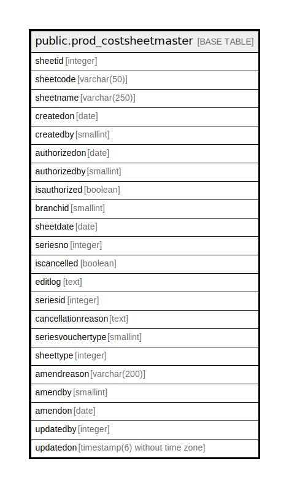

# public.prod_costsheetmaster

## Description

## Columns

| Name | Type | Default | Nullable | Children | Parents | Comment |
| ---- | ---- | ------- | -------- | -------- | ------- | ------- |
| sheetid | integer | nextval('prod_costsheetmaster_sheetid_seq'::regclass) | false |  |  |  |
| sheetcode | varchar(50) |  | true |  |  |  |
| sheetname | varchar(250) |  | true |  |  |  |
| createdon | date |  | true |  |  |  |
| createdby | smallint |  | true |  |  |  |
| authorizedon | date |  | true |  |  |  |
| authorizedby | smallint |  | true |  |  |  |
| isauthorized | boolean |  | true |  |  |  |
| branchid | smallint |  | true |  |  |  |
| sheetdate | date |  | false |  |  |  |
| seriesno | integer |  | true |  |  |  |
| iscancelled | boolean | false | true |  |  |  |
| editlog | text |  | true |  |  |  |
| seriesid | integer |  | true |  |  |  |
| cancellationreason | text |  | true |  |  |  |
| seriesvouchertype | smallint | 0 | true |  |  |  |
| sheettype | integer | 0 | true |  |  |  |
| amendreason | varchar(200) |  | true |  |  |  |
| amendby | smallint |  | true |  |  |  |
| amendon | date |  | true |  |  |  |
| updatedby | integer |  | true |  |  |  |
| updatedon | timestamp(6) without time zone | NULL::timestamp without time zone | true |  |  |  |

## Constraints

| Name | Type | Definition |
| ---- | ---- | ---------- |
| prod_costsheetmaster_pkey | PRIMARY KEY | PRIMARY KEY (sheetid) |

## Indexes

| Name | Definition |
| ---- | ---------- |
| prod_costsheetmaster_pkey | CREATE UNIQUE INDEX prod_costsheetmaster_pkey ON public.prod_costsheetmaster USING btree (sheetid) |

## Triggers

| Name | Definition |
| ---- | ---------- |
| costsheetmaster_amend_log_entry | CREATE TRIGGER costsheetmaster_amend_log_entry BEFORE UPDATE ON public.prod_costsheetmaster FOR EACH ROW EXECUTE FUNCTION costsheetmaster_amend_log_entry() |

## Relations

---

> Generated by [tbls](https://github.com/k1LoW/tbls)
