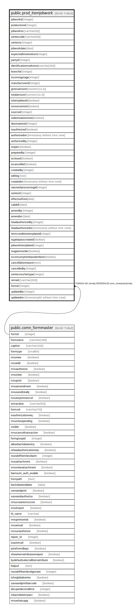

# public.prod_itemjobwork

## Description

## Columns

| Name | Type | Default | Nullable | Children | Parents | Comment |
| ---- | ---- | ------- | -------- | -------- | ------- | ------- |
| jobworkid | integer | nextval('prod_itemjobwork_jobworkid_seq'::regclass) | false |  |  |  |
| productionid | integer |  | true |  |  |  |
| jobworkno | varchar(50) |  | true |  |  |  |
| seriescode | varchar(50) |  | true |  |  |  |
| seriesno | integer |  | true |  |  |  |
| jobworkdate | date |  | true |  |  |  |
| expectedtimetoreturn | integer |  | true |  |  |  |
| partyid | integer |  | true |  |  |  |
| identificationmarkorno | varchar(200) |  | true |  |  |  |
| branchid | integer |  | true |  |  |  |
| incomingstage | integer |  | true |  |  |  |
| manufacturerid | integer |  | true |  |  |  |
| grossamount | numeric(14,4) |  | true |  |  |  |
| totalamount | numeric(14,4) |  | true |  |  |  |
| isitemjobwork | boolean |  | true |  |  |  |
| issourcestore | boolean | false | true |  |  |  |
| sourceid | integer |  | true |  |  |  |
| isdestinationstore | boolean |  | true |  |  |  |
| destinationid | integer |  | true |  |  |  |
| isauthorized | boolean | false | false |  |  |  |
| authorizedon | timestamp without time zone |  | true |  |  |  |
| authorizedby | integer |  | true |  |  |  |
| isopen | boolean | false | true |  |  |  |
| preparedby | integer |  | true |  |  |  |
| isclosed | boolean | false | true |  |  |  |
| iscancelled | boolean | false | true |  |  |  |
| createdby | integer |  | true |  |  |  |
| editlog | text |  | true |  |  |  |
| createdon | timestamp without time zone | now() | true |  |  |  |
| natureofprocessingid | integer |  | true |  |  |  |
| seriesid | integer |  | true |  |  |  |
| effectivefrom | date |  | true |  |  |  |
| validtill | date |  | true |  |  |  |
| amendby | integer |  | true |  |  |  |
| amendon | date |  | true |  |  |  |
| headauthorizedby | integer |  | true |  |  |  |
| headauthorizedon | timestamp without time zone |  | true |  |  |  |
| termconditiontemplateid | integer |  | true |  |  |  |
| isgatepasscreated | boolean | false | true |  |  |  |
| jobworktemplateid | integer |  | true |  |  |  |
| isagainstorder | boolean | false | true |  |  |  |
| isconsumptionbasedonbom | boolean | false | true |  |  |  |
| cancellationreason | text |  | true |  |  |  |
| cancelledby | integer |  | true |  |  |  |
| seriesvouchertype | integer |  | true |  |  |  |
| remark | varchar(200) | ''::character varying | true |  |  |  |
| formid | integer | 458 | false |  | [public.comn_formmaster](public.comn_formmaster.md) |  |
| updatedby | integer |  | true |  |  |  |
| updatedon | timestamp(6) without time zone | NULL::timestamp without time zone | true |  |  |  |

## Constraints

| Name | Type | Definition |
| ---- | ---- | ---------- |
| prod_itemjobwork_formid_fkey | FOREIGN KEY | FOREIGN KEY (formid) REFERENCES comn_formmaster(formid) |
| prod_jobwork_pkey | PRIMARY KEY | PRIMARY KEY (jobworkid) |

## Indexes

| Name | Definition |
| ---- | ---------- |
| prod_jobwork_pkey | CREATE UNIQUE INDEX prod_jobwork_pkey ON public.prod_itemjobwork USING btree (jobworkid) |
| Index_JobWrk_StgStk1 | CREATE INDEX "Index_JobWrk_StgStk1" ON public.prod_itemjobwork USING btree (issourcestore, isitemjobwork, iscancelled, jobworkid, branchid, jobworkdate) |
| ui_jw_dis_no | CREATE UNIQUE INDEX ui_jw_dis_no ON public.prod_itemjobwork USING btree (jobworkdate, branchid, jobworkno, seriesid) WHERE (jobworkid > 0) |

## Triggers

| Name | Definition |
| ---- | ---------- |
| jobwork_amend_log_entry | CREATE TRIGGER jobwork_amend_log_entry AFTER UPDATE ON public.prod_itemjobwork FOR EACH ROW EXECUTE FUNCTION jobwork_amend_log_entry() |

## Relations

---

> Generated by [tbls](https://github.com/k1LoW/tbls)
