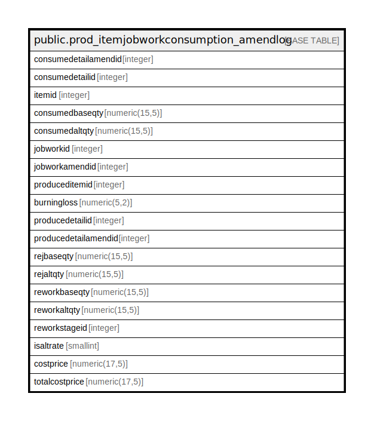

# public.prod_itemjobworkconsumption_amendlog

## Description

## Columns

| Name | Type | Default | Nullable | Children | Parents | Comment |
| ---- | ---- | ------- | -------- | -------- | ------- | ------- |
| consumedetailamendid | integer | nextval('prod_itemjobworkconsumption_amendlog_consumedetailamendid_seq'::regclass) | false |  |  |  |
| consumedetailid | integer |  | true |  |  |  |
| itemid | integer |  | true |  |  |  |
| consumedbaseqty | numeric(15,5) |  | true |  |  |  |
| consumedaltqty | numeric(15,5) |  | true |  |  |  |
| jobworkid | integer |  | true |  |  |  |
| jobworkamendid | integer |  | true |  |  |  |
| produceditemid | integer |  | true |  |  |  |
| burningloss | numeric(5,2) |  | true |  |  |  |
| producedetailid | integer |  | true |  |  |  |
| producedetailamendid | integer |  | true |  |  |  |
| rejbaseqty | numeric(15,5) |  | true |  |  |  |
| rejaltqty | numeric(15,5) |  | true |  |  |  |
| reworkbaseqty | numeric(15,5) |  | true |  |  |  |
| reworkaltqty | numeric(15,5) |  | true |  |  |  |
| reworkstageid | integer |  | true |  |  |  |
| isaltrate | smallint | 0 | true |  |  |  |
| costprice | numeric(17,5) | 0 | true |  |  |  |
| totalcostprice | numeric(17,5) | 0 | true |  |  |  |

## Constraints

| Name | Type | Definition |
| ---- | ---- | ---------- |
| prod_itemjobworkconsumption_amendlog_pkey | PRIMARY KEY | PRIMARY KEY (consumedetailamendid) |

## Indexes

| Name | Definition |
| ---- | ---------- |
| prod_itemjobworkconsumption_amendlog_pkey | CREATE UNIQUE INDEX prod_itemjobworkconsumption_amendlog_pkey ON public.prod_itemjobworkconsumption_amendlog USING btree (consumedetailamendid) |

## Relations

---

> Generated by [tbls](https://github.com/k1LoW/tbls)
