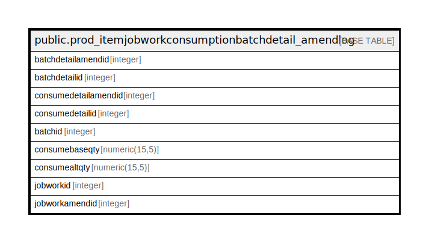

# public.prod_itemjobworkconsumptionbatchdetail_amendlog

## Description

## Columns

| Name | Type | Default | Nullable | Children | Parents | Comment |
| ---- | ---- | ------- | -------- | -------- | ------- | ------- |
| batchdetailamendid | integer | nextval('prod_itemjobworkconsumptionbatchdetail_a_batchdetailamendid_seq'::regclass) | false |  |  |  |
| batchdetailid | integer |  | true |  |  |  |
| consumedetailamendid | integer |  | true |  |  |  |
| consumedetailid | integer |  | true |  |  |  |
| batchid | integer |  | true |  |  |  |
| consumebaseqty | numeric(15,5) |  | true |  |  |  |
| consumealtqty | numeric(15,5) |  | true |  |  |  |
| jobworkid | integer |  | true |  |  |  |
| jobworkamendid | integer |  | true |  |  |  |

## Constraints

| Name | Type | Definition |
| ---- | ---- | ---------- |
| prod_itemjobworkconsumptionbatchdetail_amendlog_pkey | PRIMARY KEY | PRIMARY KEY (batchdetailamendid) |

## Indexes

| Name | Definition |
| ---- | ---------- |
| prod_itemjobworkconsumptionbatchdetail_amendlog_pkey | CREATE UNIQUE INDEX prod_itemjobworkconsumptionbatchdetail_amendlog_pkey ON public.prod_itemjobworkconsumptionbatchdetail_amendlog USING btree (batchdetailamendid) |

## Relations

---

> Generated by [tbls](https://github.com/k1LoW/tbls)
