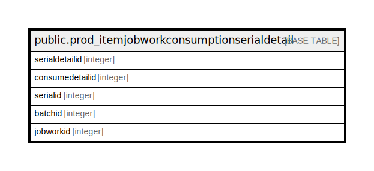

# public.prod_itemjobworkconsumptionserialdetail

## Description

## Columns

| Name | Type | Default | Nullable | Children | Parents | Comment |
| ---- | ---- | ------- | -------- | -------- | ------- | ------- |
| serialdetailid | integer | nextval('prod_itemjobworkconsumptionserialdetail_serialdetailid_seq'::regclass) | false |  |  |  |
| consumedetailid | integer |  | true |  |  |  |
| serialid | integer |  | true |  |  |  |
| batchid | integer |  | true |  |  |  |
| jobworkid | integer |  | true |  |  |  |

## Constraints

| Name | Type | Definition |
| ---- | ---- | ---------- |
| prod_itemjobconsumptionserialdetail_pkey | PRIMARY KEY | PRIMARY KEY (serialdetailid) |

## Indexes

| Name | Definition |
| ---- | ---------- |
| prod_itemjobconsumptionserialdetail_pkey | CREATE UNIQUE INDEX prod_itemjobconsumptionserialdetail_pkey ON public.prod_itemjobworkconsumptionserialdetail USING btree (serialdetailid) |

## Triggers

| Name | Definition |
| ---- | ---------- |
| itemjobworkconsumptionserialdetail_trg_checkstock | CREATE TRIGGER itemjobworkconsumptionserialdetail_trg_checkstock BEFORE INSERT OR UPDATE ON public.prod_itemjobworkconsumptionserialdetail FOR EACH ROW EXECUTE FUNCTION trg_checkstock() |
| serialhistorydata | CREATE TRIGGER serialhistorydata BEFORE INSERT ON public.prod_itemjobworkconsumptionserialdetail FOR EACH ROW EXECUTE FUNCTION tgr_serialhistory() |

## Relations

---

> Generated by [tbls](https://github.com/k1LoW/tbls)
