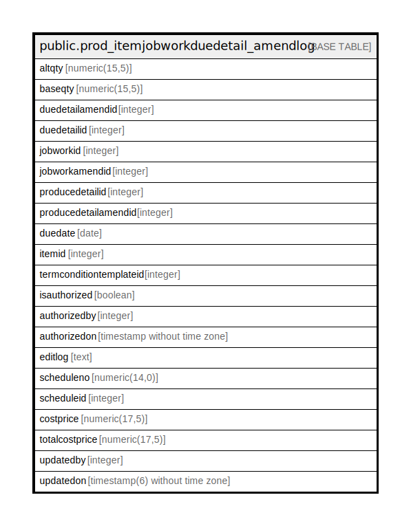

# public.prod_itemjobworkduedetail_amendlog

## Description

## Columns

| Name | Type | Default | Nullable | Children | Parents | Comment |
| ---- | ---- | ------- | -------- | -------- | ------- | ------- |
| altqty | numeric(15,5) |  | true |  |  |  |
| baseqty | numeric(15,5) |  | true |  |  |  |
| duedetailamendid | integer | nextval('prod_itemjobworkduedetail_amendlog_duedetailamendid_seq'::regclass) | false |  |  |  |
| duedetailid | integer |  | true |  |  |  |
| jobworkid | integer |  | true |  |  |  |
| jobworkamendid | integer |  | true |  |  |  |
| producedetailid | integer |  | true |  |  |  |
| producedetailamendid | integer |  | true |  |  |  |
| duedate | date |  | true |  |  |  |
| itemid | integer |  | true |  |  |  |
| termconditiontemplateid | integer |  | true |  |  |  |
| isauthorized | boolean | false | true |  |  |  |
| authorizedby | integer |  | true |  |  |  |
| authorizedon | timestamp without time zone |  | true |  |  |  |
| editlog | text |  | true |  |  |  |
| scheduleno | numeric(14,0) |  | true |  |  |  |
| scheduleid | integer |  | true |  |  |  |
| costprice | numeric(17,5) | 0 | true |  |  |  |
| totalcostprice | numeric(17,5) | 0 | true |  |  |  |
| updatedby | integer |  | true |  |  |  |
| updatedon | timestamp(6) without time zone | NULL::timestamp without time zone | true |  |  |  |

## Constraints

| Name | Type | Definition |
| ---- | ---- | ---------- |
| prod_jobworkduedetail_amendlog_pkey | PRIMARY KEY | PRIMARY KEY (duedetailamendid) |

## Indexes

| Name | Definition |
| ---- | ---------- |
| prod_jobworkduedetail_amendlog_pkey | CREATE UNIQUE INDEX prod_jobworkduedetail_amendlog_pkey ON public.prod_itemjobworkduedetail_amendlog USING btree (duedetailamendid) |

## Relations

---

> Generated by [tbls](https://github.com/k1LoW/tbls)
