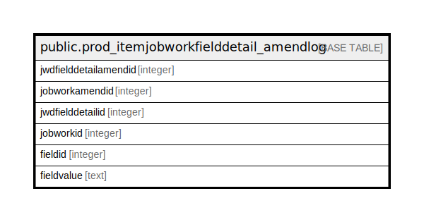

# public.prod_itemjobworkfielddetail_amendlog

## Description

## Columns

| Name | Type | Default | Nullable | Children | Parents | Comment |
| ---- | ---- | ------- | -------- | -------- | ------- | ------- |
| jwdfielddetailamendid | integer | nextval('prod_itemjobworkfielddetail_amendlog_jwdfielddetailamendid_seq'::regclass) | false |  |  |  |
| jobworkamendid | integer |  | true |  |  |  |
| jwdfielddetailid | integer |  | true |  |  |  |
| jobworkid | integer |  | true |  |  |  |
| fieldid | integer |  | true |  |  |  |
| fieldvalue | text |  | true |  |  |  |

## Constraints

| Name | Type | Definition |
| ---- | ---- | ---------- |
| prod_itemjobworkfielddetail_amendlog_pkey | PRIMARY KEY | PRIMARY KEY (jwdfielddetailamendid) |

## Indexes

| Name | Definition |
| ---- | ---------- |
| prod_itemjobworkfielddetail_amendlog_pkey | CREATE UNIQUE INDEX prod_itemjobworkfielddetail_amendlog_pkey ON public.prod_itemjobworkfielddetail_amendlog USING btree (jwdfielddetailamendid) |

## Relations

---

> Generated by [tbls](https://github.com/k1LoW/tbls)
