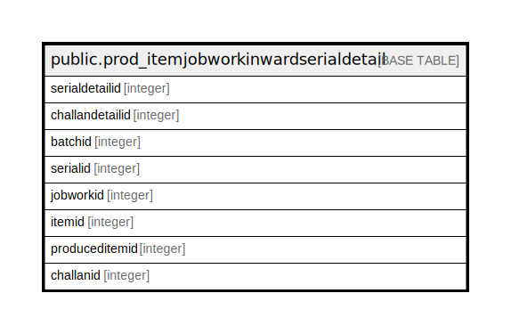

# public.prod_itemjobworkinwardserialdetail

## Description

## Columns

| Name | Type | Default | Nullable | Children | Parents | Comment |
| ---- | ---- | ------- | -------- | -------- | ------- | ------- |
| serialdetailid | integer | nextval('prod_itemjobworkinwardserialdetail_serialdetailid_seq'::regclass) | false |  |  |  |
| challandetailid | integer |  | true |  |  |  |
| batchid | integer |  | true |  |  |  |
| serialid | integer |  | true |  |  |  |
| jobworkid | integer |  | true |  |  |  |
| itemid | integer |  | true |  |  |  |
| produceditemid | integer |  | true |  |  |  |
| challanid | integer |  | true |  |  |  |

## Constraints

| Name | Type | Definition |
| ---- | ---- | ---------- |
| prod_itemjobworkinwardserialdetail_pkey | PRIMARY KEY | PRIMARY KEY (serialdetailid) |

## Indexes

| Name | Definition |
| ---- | ---------- |
| prod_itemjobworkinwardserialdetail_pkey | CREATE UNIQUE INDEX prod_itemjobworkinwardserialdetail_pkey ON public.prod_itemjobworkinwardserialdetail USING btree (serialdetailid) |

## Relations

---

> Generated by [tbls](https://github.com/k1LoW/tbls)
