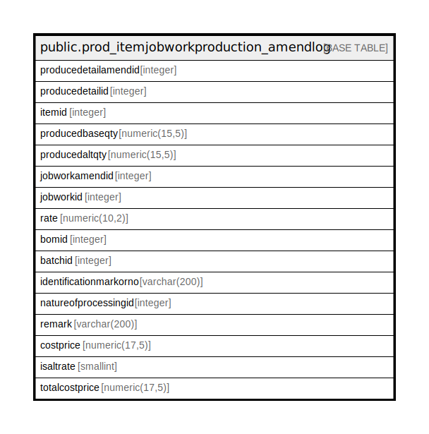

# public.prod_itemjobworkproduction_amendlog

## Description

## Columns

| Name | Type | Default | Nullable | Children | Parents | Comment |
| ---- | ---- | ------- | -------- | -------- | ------- | ------- |
| producedetailamendid | integer | nextval('prod_itemjobworkproduction_amendlog_producedetailamendid_seq'::regclass) | false |  |  |  |
| producedetailid | integer |  | true |  |  |  |
| itemid | integer |  | true |  |  |  |
| producedbaseqty | numeric(15,5) |  | true |  |  |  |
| producedaltqty | numeric(15,5) |  | true |  |  |  |
| jobworkamendid | integer |  | true |  |  |  |
| jobworkid | integer |  | true |  |  |  |
| rate | numeric(10,2) |  | true |  |  |  |
| bomid | integer |  | true |  |  |  |
| batchid | integer |  | true |  |  |  |
| identificationmarkorno | varchar(200) |  | true |  |  |  |
| natureofprocessingid | integer |  | true |  |  |  |
| remark | varchar(200) |  | true |  |  |  |
| costprice | numeric(17,5) | 0 | true |  |  |  |
| isaltrate | smallint | 0 | true |  |  |  |
| totalcostprice | numeric(17,5) | 0 | true |  |  |  |

## Constraints

| Name | Type | Definition |
| ---- | ---- | ---------- |
| prod_itemjobworkinitem_amendlog_pkey | PRIMARY KEY | PRIMARY KEY (producedetailamendid) |

## Indexes

| Name | Definition |
| ---- | ---------- |
| prod_itemjobworkinitem_amendlog_pkey | CREATE UNIQUE INDEX prod_itemjobworkinitem_amendlog_pkey ON public.prod_itemjobworkproduction_amendlog USING btree (producedetailamendid) |

## Relations

---

> Generated by [tbls](https://github.com/k1LoW/tbls)
