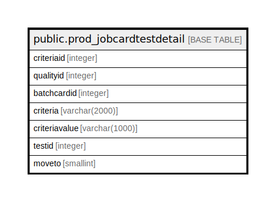

# public.prod_jobcardtestdetail

## Description

## Columns

| Name | Type | Default | Nullable | Children | Parents | Comment |
| ---- | ---- | ------- | -------- | -------- | ------- | ------- |
| criteriaid | integer | nextval('prod_jobcardtestdetail_criteriaid_seq'::regclass) | false |  |  |  |
| qualityid | integer |  | true |  |  |  |
| batchcardid | integer |  | true |  |  |  |
| criteria | varchar(2000) |  | true |  |  |  |
| criteriavalue | varchar(1000) |  | true |  |  |  |
| testid | integer |  | true |  |  |  |
| moveto | smallint |  | true |  |  |  |

## Constraints

| Name | Type | Definition |
| ---- | ---- | ---------- |
| prod_jobcardtestdetail_pkey | PRIMARY KEY | PRIMARY KEY (criteriaid) |

## Indexes

| Name | Definition |
| ---- | ---------- |
| prod_jobcardtestdetail_pkey | CREATE UNIQUE INDEX prod_jobcardtestdetail_pkey ON public.prod_jobcardtestdetail USING btree (criteriaid) |

## Relations

---

> Generated by [tbls](https://github.com/k1LoW/tbls)
