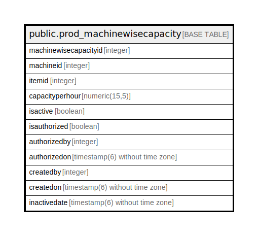

# public.prod_machinewisecapacity

## Description

## Columns

| Name | Type | Default | Nullable | Children | Parents | Comment |
| ---- | ---- | ------- | -------- | -------- | ------- | ------- |
| machinewisecapacityid | integer | nextval('prod_machinewisecapacity_machinewisecapacityid_seq'::regclass) | false |  |  |  |
| machineid | integer |  | true |  |  |  |
| itemid | integer |  | true |  |  |  |
| capacityperhour | numeric(15,5) |  | true |  |  |  |
| isactive | boolean | false | true |  |  |  |
| isauthorized | boolean |  | true |  |  |  |
| authorizedby | integer |  | true |  |  |  |
| authorizedon | timestamp(6) without time zone |  | true |  |  |  |
| createdby | integer |  | true |  |  |  |
| createdon | timestamp(6) without time zone |  | true |  |  |  |
| inactivedate | timestamp(6) without time zone |  | true |  |  |  |

## Constraints

| Name | Type | Definition |
| ---- | ---- | ---------- |
| prod_machinewisecapacity_pkey | PRIMARY KEY | PRIMARY KEY (machinewisecapacityid) |

## Indexes

| Name | Definition |
| ---- | ---------- |
| prod_machinewisecapacity_pkey | CREATE UNIQUE INDEX prod_machinewisecapacity_pkey ON public.prod_machinewisecapacity USING btree (machinewisecapacityid) |

## Relations

---

> Generated by [tbls](https://github.com/k1LoW/tbls)
