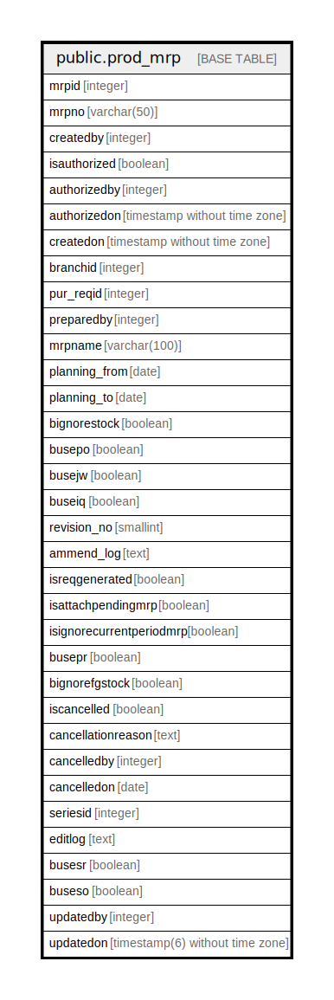

# public.prod_mrp

## Description

## Columns

| Name | Type | Default | Nullable | Children | Parents | Comment |
| ---- | ---- | ------- | -------- | -------- | ------- | ------- |
| mrpid | integer | nextval('prod_mrp_mrpid_seq'::regclass) | false |  |  |  |
| mrpname | varchar(100) |  | true |  |  |  |
| mrpno | varchar(50) |  | true |  |  |  |
| createdby | integer |  | true |  |  |  |
| isauthorized | boolean | false | true |  |  |  |
| authorizedby | integer |  | true |  |  |  |
| authorizedon | timestamp without time zone |  | true |  |  |  |
| createdon | timestamp without time zone | now() | true |  |  |  |
| branchid | integer |  | true |  |  |  |
| pur_reqid | integer |  | true |  |  |  |
| preparedby | integer |  | true |  |  |  |
| planning_from | date |  | true |  |  |  |
| planning_to | date |  | true |  |  |  |
| bignorestock | boolean | true | true |  |  |  |
| busepo | boolean | false | true |  |  |  |
| busejw | boolean | true | true |  |  |  |
| buseiq | boolean | true | true |  |  |  |
| revision_no | smallint |  | true |  |  |  |
| ammend_log | text |  | true |  |  |  |
| isreqgenerated | boolean | false | true |  |  |  |
| isattachpendingmrp | boolean | false | true |  |  |  |
| isignorecurrentperiodmrp | boolean | false | true |  |  |  |
| busepr | boolean | false | true |  |  |  |
| bignorefgstock | boolean | false | true |  |  |  |
| iscancelled | boolean | false | true |  |  |  |
| cancellationreason | text |  | true |  |  |  |
| cancelledby | integer |  | true |  |  |  |
| cancelledon | date |  | true |  |  |  |
| seriesid | integer |  | true |  |  |  |
| editlog | text |  | true |  |  |  |
| busesr | boolean | false | true |  |  |  |
| buseso | boolean | false | true |  |  |  |
| updatedby | integer |  | true |  |  |  |
| updatedon | timestamp(6) without time zone | NULL::timestamp without time zone | true |  |  |  |

## Constraints

| Name | Type | Definition |
| ---- | ---- | ---------- |
| prod_mrp_pkey | PRIMARY KEY | PRIMARY KEY (mrpid) |

## Indexes

| Name | Definition |
| ---- | ---------- |
| prod_mrp_pkey | CREATE UNIQUE INDEX prod_mrp_pkey ON public.prod_mrp USING btree (mrpid) |

## Relations

---

> Generated by [tbls](https://github.com/k1LoW/tbls)
