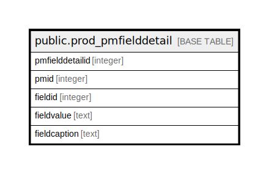

# public.prod_pmfielddetail

## Description

## Columns

| Name | Type | Default | Nullable | Children | Parents | Comment |
| ---- | ---- | ------- | -------- | -------- | ------- | ------- |
| pmfielddetailid | integer | nextval('prod_pmfielddetail_pmfielddetailid_seq'::regclass) | false |  |  |  |
| pmid | integer |  | true |  |  |  |
| fieldid | integer |  | true |  |  |  |
| fieldvalue | text |  | true |  |  |  |
| fieldcaption | text |  | true |  |  |  |

## Constraints

| Name | Type | Definition |
| ---- | ---- | ---------- |
| prod_pmfielddetail_key | PRIMARY KEY | PRIMARY KEY (pmfielddetailid) |

## Indexes

| Name | Definition |
| ---- | ---------- |
| prod_pmfielddetail_key | CREATE UNIQUE INDEX prod_pmfielddetail_key ON public.prod_pmfielddetail USING btree (pmfielddetailid) |

## Relations

---

> Generated by [tbls](https://github.com/k1LoW/tbls)
