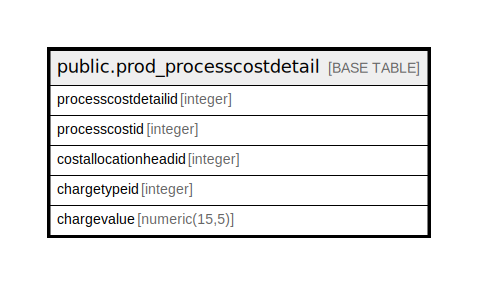

# public.prod_processcostdetail

## Description

## Columns

| Name | Type | Default | Nullable | Children | Parents | Comment |
| ---- | ---- | ------- | -------- | -------- | ------- | ------- |
| processcostdetailid | integer | nextval('prod_processcostdetail_processcostdetailid_seq'::regclass) | false |  |  |  |
| processcostid | integer |  | true |  |  |  |
| costallocationheadid | integer |  | true |  |  |  |
| chargetypeid | integer |  | true |  |  |  |
| chargevalue | numeric(15,5) |  | true |  |  |  |

## Constraints

| Name | Type | Definition |
| ---- | ---- | ---------- |
| prod_processcostdetail_pkey | PRIMARY KEY | PRIMARY KEY (processcostdetailid) |

## Indexes

| Name | Definition |
| ---- | ---------- |
| prod_processcostdetail_pkey | CREATE UNIQUE INDEX prod_processcostdetail_pkey ON public.prod_processcostdetail USING btree (processcostdetailid) |

## Relations

---

> Generated by [tbls](https://github.com/k1LoW/tbls)
