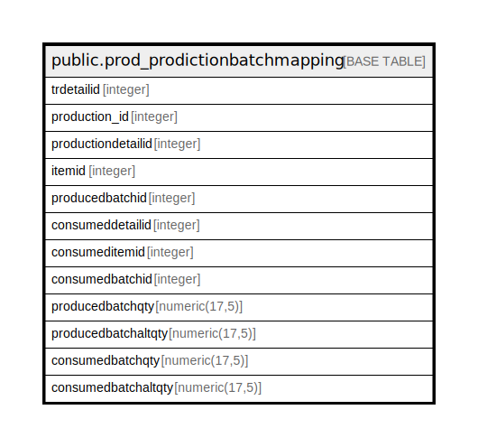

# public.prod_prodictionbatchmapping

## Description

## Columns

| Name | Type | Default | Nullable | Children | Parents | Comment |
| ---- | ---- | ------- | -------- | -------- | ------- | ------- |
| trdetailid | integer | nextval('prod_prodictionbatchmapping_trdetailid_seq'::regclass) | false |  |  |  |
| production_id | integer |  | true |  |  |  |
| productiondetailid | integer |  | true |  |  |  |
| itemid | integer |  | true |  |  |  |
| producedbatchid | integer |  | true |  |  |  |
| consumeddetailid | integer |  | true |  |  |  |
| consumeditemid | integer |  | true |  |  |  |
| consumedbatchid | integer |  | true |  |  |  |
| producedbatchqty | numeric(17,5) |  | true |  |  |  |
| producedbatchaltqty | numeric(17,5) |  | true |  |  |  |
| consumedbatchqty | numeric(17,5) |  | true |  |  |  |
| consumedbatchaltqty | numeric(17,5) |  | true |  |  |  |

## Relations

---

> Generated by [tbls](https://github.com/k1LoW/tbls)
