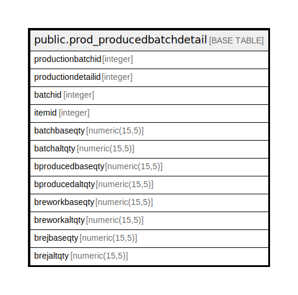

# public.prod_producedbatchdetail

## Description

## Columns

| Name | Type | Default | Nullable | Children | Parents | Comment |
| ---- | ---- | ------- | -------- | -------- | ------- | ------- |
| productionbatchid | integer | nextval('prod_producedbatchdetail_productionbatchid_seq'::regclass) | false |  |  |  |
| productiondetailid | integer |  | true |  |  |  |
| batchid | integer |  | true |  |  |  |
| itemid | integer |  | true |  |  |  |
| batchbaseqty | numeric(15,5) |  | true |  |  |  |
| batchaltqty | numeric(15,5) |  | true |  |  |  |
| bproducedbaseqty | numeric(15,5) |  | true |  |  |  |
| bproducedaltqty | numeric(15,5) |  | true |  |  |  |
| breworkbaseqty | numeric(15,5) |  | true |  |  |  |
| breworkaltqty | numeric(15,5) |  | true |  |  |  |
| brejbaseqty | numeric(15,5) |  | true |  |  |  |
| brejaltqty | numeric(15,5) |  | true |  |  |  |

## Constraints

| Name | Type | Definition |
| ---- | ---- | ---------- |
| productionbatchid_pkey | PRIMARY KEY | PRIMARY KEY (productionbatchid) |

## Indexes

| Name | Definition |
| ---- | ---------- |
| productionbatchid_pkey | CREATE UNIQUE INDEX productionbatchid_pkey ON public.prod_producedbatchdetail USING btree (productionbatchid) |
| Index_PE_BatDet_PEDetID | CREATE INDEX "Index_PE_BatDet_PEDetID" ON public.prod_producedbatchdetail USING btree (productiondetailid) |
| ui_prdbatchdet | CREATE UNIQUE INDEX ui_prdbatchdet ON public.prod_producedbatchdetail USING btree (productiondetailid, batchid, itemid, bproducedbaseqty, batchbaseqty) WHERE (productionbatchid > 0) |

## Relations

---

> Generated by [tbls](https://github.com/k1LoW/tbls)
