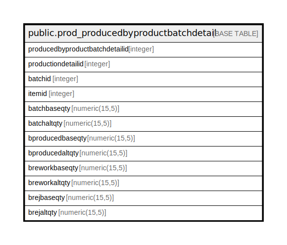

# public.prod_producedbyproductbatchdetail

## Description

## Columns

| Name | Type | Default | Nullable | Children | Parents | Comment |
| ---- | ---- | ------- | -------- | -------- | ------- | ------- |
| producedbyproductbatchdetailid | integer | nextval('prod_producedbyproductbatchde_producedbyproductbatchdetaili_seq'::regclass) | false |  |  |  |
| productiondetailid | integer |  | true |  |  |  |
| batchid | integer |  | true |  |  |  |
| itemid | integer |  | true |  |  |  |
| batchbaseqty | numeric(15,5) |  | true |  |  |  |
| batchaltqty | numeric(15,5) |  | true |  |  |  |
| bproducedbaseqty | numeric(15,5) |  | true |  |  |  |
| bproducedaltqty | numeric(15,5) |  | true |  |  |  |
| breworkbaseqty | numeric(15,5) |  | true |  |  |  |
| breworkaltqty | numeric(15,5) |  | true |  |  |  |
| brejbaseqty | numeric(15,5) |  | true |  |  |  |
| brejaltqty | numeric(15,5) |  | true |  |  |  |

## Constraints

| Name | Type | Definition |
| ---- | ---- | ---------- |
| prod_producedbyproductbatchdetail_pkey | PRIMARY KEY | PRIMARY KEY (producedbyproductbatchdetailid) |

## Indexes

| Name | Definition |
| ---- | ---------- |
| prod_producedbyproductbatchdetail_pkey | CREATE UNIQUE INDEX prod_producedbyproductbatchdetail_pkey ON public.prod_producedbyproductbatchdetail USING btree (producedbyproductbatchdetailid) |

## Relations

---

> Generated by [tbls](https://github.com/k1LoW/tbls)
