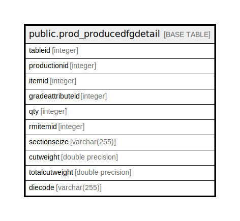

# public.prod_producedfgdetail

## Description

## Columns

| Name | Type | Default | Nullable | Children | Parents | Comment |
| ---- | ---- | ------- | -------- | -------- | ------- | ------- |
| tableid | integer | nextval('prod_producedfgdetail_tableid_seq'::regclass) | false |  |  |  |
| productionid | integer |  | true |  |  |  |
| itemid | integer |  | true |  |  |  |
| gradeattributeid | integer |  | true |  |  |  |
| qty | integer |  | true |  |  |  |
| rmitemid | integer |  | true |  |  |  |
| sectionseize | varchar(255) |  | true |  |  |  |
| cutweight | double precision |  | true |  |  |  |
| totalcutweight | double precision |  | true |  |  |  |
| diecode | varchar(255) |  | true |  |  |  |

## Constraints

| Name | Type | Definition |
| ---- | ---- | ---------- |
| prod_producedfgdetail_pkey | PRIMARY KEY | PRIMARY KEY (tableid) |

## Indexes

| Name | Definition |
| ---- | ---------- |
| prod_producedfgdetail_pkey | CREATE UNIQUE INDEX prod_producedfgdetail_pkey ON public.prod_producedfgdetail USING btree (tableid) |

## Relations

---

> Generated by [tbls](https://github.com/k1LoW/tbls)
