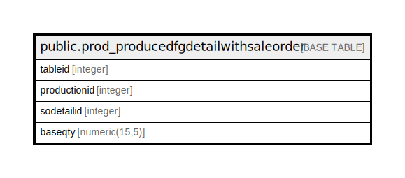

# public.prod_producedfgdetailwithsaleorder

## Description

## Columns

| Name | Type | Default | Nullable | Children | Parents | Comment |
| ---- | ---- | ------- | -------- | -------- | ------- | ------- |
| tableid | integer | nextval('prod_producedfgdetailwithsaleorder_tableid_seq'::regclass) | false |  |  |  |
| productionid | integer |  | true |  |  |  |
| sodetailid | integer |  | true |  |  |  |
| baseqty | numeric(15,5) |  | true |  |  |  |

## Constraints

| Name | Type | Definition |
| ---- | ---- | ---------- |
| prod_producedfgdetailwithsaleorder_pkey | PRIMARY KEY | PRIMARY KEY (tableid) |

## Indexes

| Name | Definition |
| ---- | ---------- |
| prod_producedfgdetailwithsaleorder_pkey | CREATE UNIQUE INDEX prod_producedfgdetailwithsaleorder_pkey ON public.prod_producedfgdetailwithsaleorder USING btree (tableid) |

## Relations

---

> Generated by [tbls](https://github.com/k1LoW/tbls)
