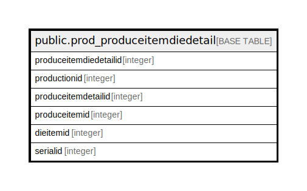

# public.prod_produceitemdiedetail

## Description

## Columns

| Name | Type | Default | Nullable | Children | Parents | Comment |
| ---- | ---- | ------- | -------- | -------- | ------- | ------- |
| produceitemdiedetailid | integer | nextval('prod_produceitemdiedetail_produceitemdiedetailid_seq'::regclass) | false |  |  |  |
| productionid | integer |  | true |  |  |  |
| produceitemdetailid | integer |  | true |  |  |  |
| produceitemid | integer |  | true |  |  |  |
| dieitemid | integer |  | true |  |  |  |
| serialid | integer |  | true |  |  |  |

## Relations

---

> Generated by [tbls](https://github.com/k1LoW/tbls)
