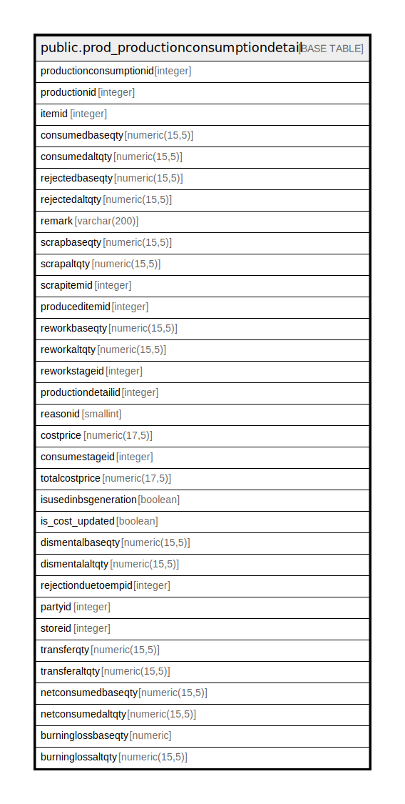

# public.prod_productionconsumptiondetail

## Description

## Columns

| Name | Type | Default | Nullable | Children | Parents | Comment |
| ---- | ---- | ------- | -------- | -------- | ------- | ------- |
| productionconsumptionid | integer | nextval('prod_productionconsumptiondetail_productionconsumptionid_seq'::regclass) | false |  |  |  |
| productionid | integer |  | true |  |  |  |
| itemid | integer |  | true |  |  |  |
| consumedbaseqty | numeric(15,5) |  | true |  |  |  |
| consumedaltqty | numeric(15,5) |  | true |  |  |  |
| rejectedbaseqty | numeric(15,5) |  | true |  |  |  |
| rejectedaltqty | numeric(15,5) |  | true |  |  |  |
| remark | varchar(200) |  | true |  |  |  |
| scrapbaseqty | numeric(15,5) |  | true |  |  |  |
| scrapaltqty | numeric(15,5) |  | true |  |  |  |
| scrapitemid | integer |  | true |  |  |  |
| produceditemid | integer |  | true |  |  |  |
| reworkbaseqty | numeric(15,5) |  | true |  |  |  |
| reworkaltqty | numeric(15,5) |  | true |  |  |  |
| reworkstageid | integer |  | true |  |  |  |
| productiondetailid | integer |  | true |  |  |  |
| reasonid | smallint |  | true |  |  |  |
| costprice | numeric(17,5) | 0 | true |  |  |  |
| consumestageid | integer |  | true |  |  |  |
| totalcostprice | numeric(17,5) | 0 | true |  |  |  |
| isusedinbsgeneration | boolean | false | true |  |  |  |
| is_cost_updated | boolean | true | false |  |  |  |
| dismentalbaseqty | numeric(15,5) | 0 | true |  |  |  |
| dismentalaltqty | numeric(15,5) | 0 | true |  |  |  |
| rejectionduetoempid | integer |  | true |  |  |  |
| partyid | integer |  | true |  |  |  |
| storeid | integer |  | true |  |  |  |
| transferqty | numeric(15,5) |  | true |  |  |  |
| transferaltqty | numeric(15,5) |  | true |  |  |  |
| netconsumedbaseqty | numeric(15,5) |  | true |  |  |  |
| netconsumedaltqty | numeric(15,5) |  | true |  |  |  |
| burninglossbaseqty | numeric | 0 | true |  |  |  |
| burninglossaltqty | numeric(15,5) | 0 | true |  |  |  |

## Constraints

| Name | Type | Definition |
| ---- | ---- | ---------- |
| prod_productionconsumptiondetail_pkey | PRIMARY KEY | PRIMARY KEY (productionconsumptionid) |

## Indexes

| Name | Definition |
| ---- | ---------- |
| prod_productionconsumptiondetail_pkey | CREATE UNIQUE INDEX prod_productionconsumptiondetail_pkey ON public.prod_productionconsumptiondetail USING btree (productionconsumptionid) |
| Index_PE_ConsDet_PEID | CREATE INDEX "Index_PE_ConsDet_PEID" ON public.prod_productionconsumptiondetail USING btree (productionid) |

## Triggers

| Name | Definition |
| ---- | ---------- |
| prodconsumptiondetail_trg_checkstock | CREATE TRIGGER prodconsumptiondetail_trg_checkstock BEFORE INSERT ON public.prod_productionconsumptiondetail FOR EACH ROW EXECUTE FUNCTION trg_checkstock() |

## Relations

---

> Generated by [tbls](https://github.com/k1LoW/tbls)
