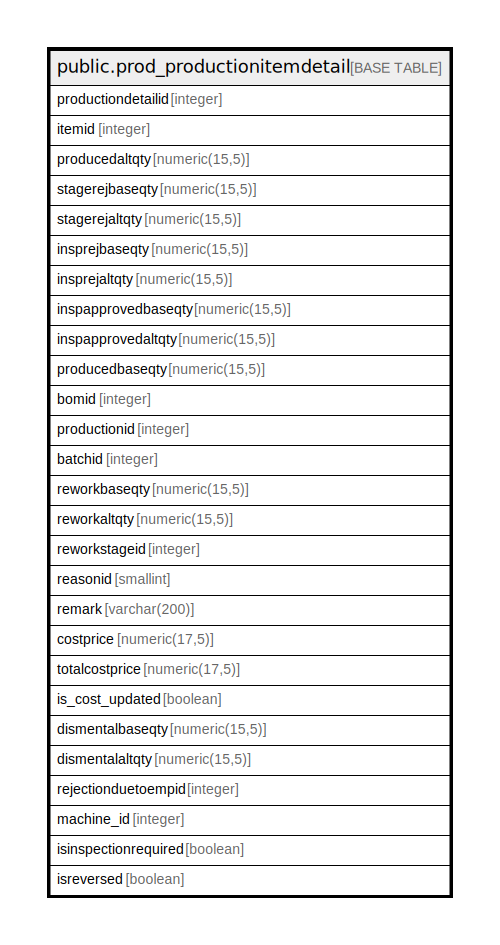

# public.prod_productionitemdetail

## Description

## Columns

| Name | Type | Default | Nullable | Children | Parents | Comment |
| ---- | ---- | ------- | -------- | -------- | ------- | ------- |
| productiondetailid | integer | nextval('prod_productionitemdetail_productiondetailid_seq'::regclass) | false |  |  |  |
| itemid | integer |  | true |  |  |  |
| producedaltqty | numeric(15,5) |  | true |  |  |  |
| stagerejbaseqty | numeric(15,5) |  | true |  |  |  |
| stagerejaltqty | numeric(15,5) |  | true |  |  |  |
| insprejbaseqty | numeric(15,5) |  | true |  |  |  |
| insprejaltqty | numeric(15,5) |  | true |  |  |  |
| inspapprovedbaseqty | numeric(15,5) |  | true |  |  |  |
| inspapprovedaltqty | numeric(15,5) |  | true |  |  |  |
| producedbaseqty | numeric(15,5) |  | true |  |  |  |
| bomid | integer |  | true |  |  |  |
| productionid | integer |  | true |  |  |  |
| batchid | integer |  | true |  |  |  |
| reworkbaseqty | numeric(15,5) |  | true |  |  |  |
| reworkaltqty | numeric(15,5) |  | true |  |  |  |
| reworkstageid | integer |  | true |  |  |  |
| reasonid | smallint |  | true |  |  |  |
| remark | varchar(200) |  | true |  |  |  |
| costprice | numeric(17,5) | 0 | true |  |  |  |
| totalcostprice | numeric(17,5) | 0 | true |  |  |  |
| is_cost_updated | boolean | true | false |  |  |  |
| dismentalbaseqty | numeric(15,5) | 0 | true |  |  |  |
| dismentalaltqty | numeric(15,5) | 0 | true |  |  |  |
| rejectionduetoempid | integer |  | true |  |  |  |
| machine_id | integer |  | true |  |  |  |
| isinspectionrequired | boolean | false | true |  |  |  |
| isreversed | boolean | false | true |  |  |  |

## Constraints

| Name | Type | Definition |
| ---- | ---- | ---------- |
| prod_productiondetail_pkey | PRIMARY KEY | PRIMARY KEY (productiondetailid) |

## Indexes

| Name | Definition |
| ---- | ---------- |
| prod_productiondetail_pkey | CREATE UNIQUE INDEX prod_productiondetail_pkey ON public.prod_productionitemdetail USING btree (productiondetailid) |
| Index_PE_Det_PEID | CREATE INDEX "Index_PE_Det_PEID" ON public.prod_productionitemdetail USING btree (productionid) |

## Triggers

| Name | Definition |
| ---- | ---------- |
| tgr_checkbatchcardstock | CREATE TRIGGER tgr_checkbatchcardstock BEFORE INSERT ON public.prod_productionitemdetail FOR EACH ROW EXECUTE FUNCTION tgr_checkbatchcardstock() |

## Relations

---

> Generated by [tbls](https://github.com/k1LoW/tbls)
