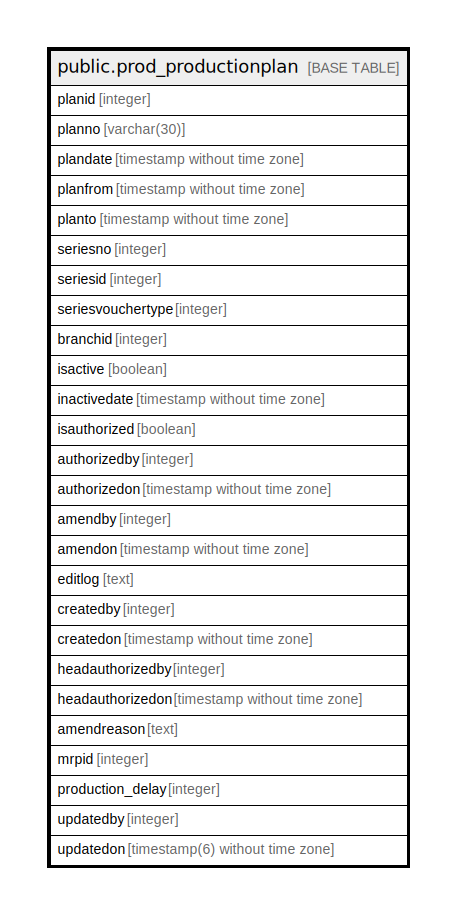

# public.prod_productionplan

## Description

## Columns

| Name | Type | Default | Nullable | Children | Parents | Comment |
| ---- | ---- | ------- | -------- | -------- | ------- | ------- |
| planid | integer | nextval('prod_productionplan_planid_seq'::regclass) | false |  |  |  |
| planno | varchar(30) |  | true |  |  |  |
| plandate | timestamp without time zone |  | true |  |  |  |
| planfrom | timestamp without time zone |  | true |  |  |  |
| planto | timestamp without time zone |  | true |  |  |  |
| seriesno | integer |  | true |  |  |  |
| seriesid | integer |  | true |  |  |  |
| seriesvouchertype | integer |  | true |  |  |  |
| branchid | integer |  | true |  |  |  |
| isactive | boolean | false | false |  |  |  |
| inactivedate | timestamp without time zone |  | true |  |  |  |
| isauthorized | boolean | false | false |  |  |  |
| authorizedby | integer |  | true |  |  |  |
| authorizedon | timestamp without time zone |  | true |  |  |  |
| amendby | integer |  | true |  |  |  |
| amendon | timestamp without time zone |  | true |  |  |  |
| editlog | text |  | true |  |  |  |
| createdby | integer |  | true |  |  |  |
| createdon | timestamp without time zone | now() | true |  |  |  |
| headauthorizedby | integer |  | true |  |  |  |
| headauthorizedon | timestamp without time zone |  | true |  |  |  |
| amendreason | text |  | true |  |  |  |
| mrpid | integer |  | true |  |  |  |
| production_delay | integer |  | true |  |  |  |
| updatedby | integer |  | true |  |  |  |
| updatedon | timestamp(6) without time zone | NULL::timestamp without time zone | true |  |  |  |

## Constraints

| Name | Type | Definition |
| ---- | ---- | ---------- |
| prod_productionplan_pkey | PRIMARY KEY | PRIMARY KEY (planid) |

## Indexes

| Name | Definition |
| ---- | ---------- |
| prod_productionplan_pkey | CREATE UNIQUE INDEX prod_productionplan_pkey ON public.prod_productionplan USING btree (planid) |

## Triggers

| Name | Definition |
| ---- | ---------- |
| pp_amend_log_entry | CREATE TRIGGER pp_amend_log_entry BEFORE UPDATE ON public.prod_productionplan FOR EACH ROW EXECUTE FUNCTION pp_amend_log_entry() |

## Relations

---

> Generated by [tbls](https://github.com/k1LoW/tbls)
