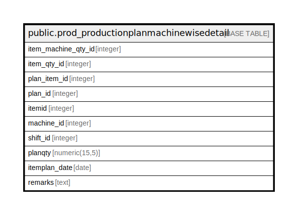

# public.prod_productionplanmachinewisedetail

## Description

## Columns

| Name | Type | Default | Nullable | Children | Parents | Comment |
| ---- | ---- | ------- | -------- | -------- | ------- | ------- |
| item_machine_qty_id | integer | nextval('prod_productionplanmachinewisedetail_item_machine_qty_id_seq'::regclass) | false |  |  |  |
| item_qty_id | integer |  | true |  |  |  |
| plan_item_id | integer |  | true |  |  |  |
| plan_id | integer |  | true |  |  |  |
| itemid | integer |  | true |  |  |  |
| machine_id | integer |  | true |  |  |  |
| shift_id | integer |  | true |  |  |  |
| planqty | numeric(15,5) |  | true |  |  |  |
| itemplan_date | date |  | true |  |  |  |
| remarks | text |  | true |  |  |  |

## Relations

---

> Generated by [tbls](https://github.com/k1LoW/tbls)
