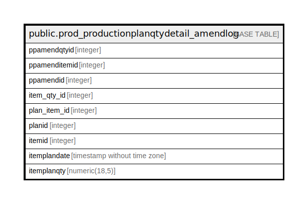

# public.prod_productionplanqtydetail_amendlog

## Description

## Columns

| Name | Type | Default | Nullable | Children | Parents | Comment |
| ---- | ---- | ------- | -------- | -------- | ------- | ------- |
| ppamendqtyid | integer | nextval('prod_productionplanqtydetail_amendlog_ppamendqtyid_seq'::regclass) | false |  |  |  |
| ppamenditemid | integer |  | false |  |  |  |
| ppamendid | integer |  | false |  |  |  |
| item_qty_id | integer |  | false |  |  |  |
| plan_item_id | integer |  | false |  |  |  |
| planid | integer |  | false |  |  |  |
| itemid | integer |  | false |  |  |  |
| itemplandate | timestamp without time zone |  | true |  |  |  |
| itemplanqty | numeric(18,5) |  | true |  |  |  |

## Constraints

| Name | Type | Definition |
| ---- | ---- | ---------- |
| prod_productionplanqtydetail_amendlog_pkey | PRIMARY KEY | PRIMARY KEY (ppamendqtyid) |

## Indexes

| Name | Definition |
| ---- | ---------- |
| prod_productionplanqtydetail_amendlog_pkey | CREATE UNIQUE INDEX prod_productionplanqtydetail_amendlog_pkey ON public.prod_productionplanqtydetail_amendlog USING btree (ppamendqtyid) |

## Relations

---

> Generated by [tbls](https://github.com/k1LoW/tbls)
