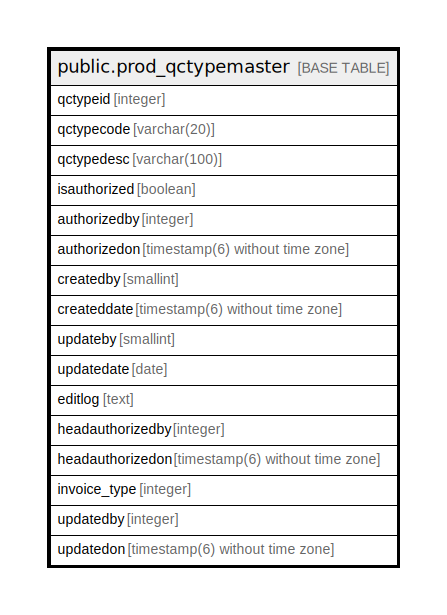

# public.prod_qctypemaster

## Description

## Columns

| Name | Type | Default | Nullable | Children | Parents | Comment |
| ---- | ---- | ------- | -------- | -------- | ------- | ------- |
| qctypeid | integer | nextval('prod_qctypemaster_qctypeid_seq'::regclass) | false |  |  |  |
| qctypecode | varchar(20) |  | false |  |  |  |
| qctypedesc | varchar(100) |  | false |  |  |  |
| isauthorized | boolean | false | false |  |  |  |
| authorizedby | integer |  | true |  |  |  |
| authorizedon | timestamp(6) without time zone |  | true |  |  |  |
| createdby | smallint |  | true |  |  |  |
| createddate | timestamp(6) without time zone | now() | true |  |  |  |
| updateby | smallint |  | true |  |  |  |
| updatedate | date |  | true |  |  |  |
| editlog | text |  | true |  |  |  |
| headauthorizedby | integer |  | true |  |  |  |
| headauthorizedon | timestamp(6) without time zone |  | true |  |  |  |
| invoice_type | integer | 0 | true |  |  |  |
| updatedby | integer |  | true |  |  |  |
| updatedon | timestamp(6) without time zone | NULL::timestamp without time zone | true |  |  |  |

## Constraints

| Name | Type | Definition |
| ---- | ---- | ---------- |
| prod_qctypemaster_pkey | PRIMARY KEY | PRIMARY KEY (qctypeid) |
| qctypemaster_qctypecode_key | UNIQUE | UNIQUE (qctypecode) |
| qctypemaster_qctypedesc_key | UNIQUE | UNIQUE (qctypedesc) |

## Indexes

| Name | Definition |
| ---- | ---------- |
| prod_qctypemaster_pkey | CREATE UNIQUE INDEX prod_qctypemaster_pkey ON public.prod_qctypemaster USING btree (qctypeid) |
| qctypemaster_qctypecode_key | CREATE UNIQUE INDEX qctypemaster_qctypecode_key ON public.prod_qctypemaster USING btree (qctypecode) |
| qctypemaster_qctypedesc_key | CREATE UNIQUE INDEX qctypemaster_qctypedesc_key ON public.prod_qctypemaster USING btree (qctypedesc) |

## Relations

---

> Generated by [tbls](https://github.com/k1LoW/tbls)
