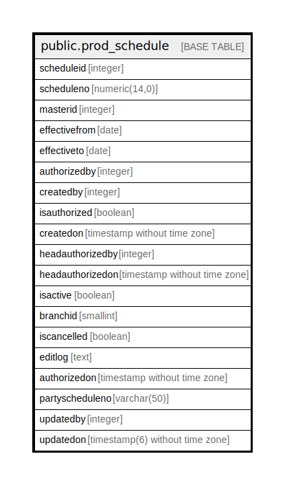

# public.prod_schedule

## Description

## Columns

| Name | Type | Default | Nullable | Children | Parents | Comment |
| ---- | ---- | ------- | -------- | -------- | ------- | ------- |
| scheduleid | integer | nextval('prod_schedule_scheduleid_seq'::regclass) | false |  |  |  |
| scheduleno | numeric(14,0) |  | true |  |  |  |
| masterid | integer |  | true |  |  |  |
| effectivefrom | date |  | true |  |  |  |
| effectiveto | date |  | true |  |  |  |
| authorizedby | integer |  | true |  |  |  |
| createdby | integer |  | true |  |  |  |
| isauthorized | boolean | false | true |  |  |  |
| createdon | timestamp without time zone | now() | true |  |  |  |
| headauthorizedby | integer |  | true |  |  |  |
| headauthorizedon | timestamp without time zone |  | true |  |  |  |
| isactive | boolean | false | true |  |  |  |
| branchid | smallint |  | true |  |  |  |
| iscancelled | boolean | false | true |  |  |  |
| editlog | text |  | true |  |  |  |
| authorizedon | timestamp without time zone |  | true |  |  |  |
| partyscheduleno | varchar(50) |  | true |  |  |  |
| updatedby | integer |  | true |  |  |  |
| updatedon | timestamp(6) without time zone | NULL::timestamp without time zone | true |  |  |  |

## Constraints

| Name | Type | Definition |
| ---- | ---- | ---------- |
| Prod_Schedule_Constraint | UNIQUE | UNIQUE (scheduleno, masterid, branchid) |
| prod_schedule_pkey | PRIMARY KEY | PRIMARY KEY (scheduleid) |

## Indexes

| Name | Definition |
| ---- | ---------- |
| Prod_Schedule_Constraint | CREATE UNIQUE INDEX "Prod_Schedule_Constraint" ON public.prod_schedule USING btree (scheduleno, masterid, branchid) |
| prod_schedule_pkey | CREATE UNIQUE INDEX prod_schedule_pkey ON public.prod_schedule USING btree (scheduleid) |

## Relations

---

> Generated by [tbls](https://github.com/k1LoW/tbls)
