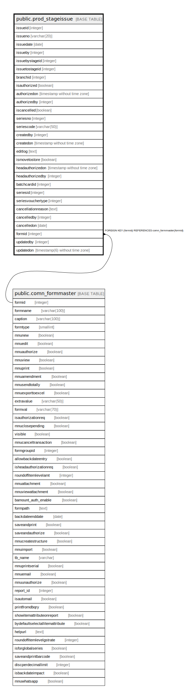

# public.prod_stageissue

## Description

## Columns

| Name | Type | Default | Nullable | Children | Parents | Comment |
| ---- | ---- | ------- | -------- | -------- | ------- | ------- |
| issueid | integer | nextval('prod_stageissue_issueid_seq'::regclass) | false |  |  |  |
| issueno | varchar(20) | NULL::character varying | false |  |  |  |
| issuedate | date |  | true |  |  |  |
| issueby | integer |  | true |  |  |  |
| issuebystageid | integer |  | true |  |  |  |
| issuetostageid | integer |  | true |  |  |  |
| branchid | integer |  | true |  |  |  |
| isauthorized | boolean | false | false |  |  |  |
| authorizedon | timestamp without time zone |  | true |  |  |  |
| authorizedby | integer |  | true |  |  |  |
| iscancelled | boolean | false | false |  |  |  |
| seriesno | integer |  | true |  |  |  |
| seriescode | varchar(50) | NULL::character varying | true |  |  |  |
| createdby | integer |  | true |  |  |  |
| createdon | timestamp without time zone | now() | true |  |  |  |
| editlog | text |  | true |  |  |  |
| ismovetostore | boolean | false | true |  |  | If issue to in store then True Else if in stage then False. |
| headauthorizedon | timestamp without time zone |  | true |  |  |  |
| headauthorizedby | integer |  | true |  |  |  |
| batchcardid | integer |  | true |  |  |  |
| seriesid | integer |  | true |  |  |  |
| seriesvouchertype | integer |  | true |  |  |  |
| cancellationreason | text |  | true |  |  |  |
| cancelledby | integer |  | true |  |  |  |
| cancelledon | date |  | true |  |  |  |
| formid | integer | 120 | false |  | [public.comn_formmaster](public.comn_formmaster.md) |  |
| updatedby | integer |  | true |  |  |  |
| updatedon | timestamp(6) without time zone | NULL::timestamp without time zone | true |  |  |  |

## Constraints

| Name | Type | Definition |
| ---- | ---- | ---------- |
| Unique Issue No | UNIQUE | UNIQUE (issueno) |
| prod_stageissue_formid_fkey | FOREIGN KEY | FOREIGN KEY (formid) REFERENCES comn_formmaster(formid) |
| prod_stageissue_pkey | PRIMARY KEY | PRIMARY KEY (issueid) |

## Indexes

| Name | Definition |
| ---- | ---------- |
| Unique Issue No | CREATE UNIQUE INDEX "Unique Issue No" ON public.prod_stageissue USING btree (issueno) |
| prod_stageissue_pkey | CREATE UNIQUE INDEX prod_stageissue_pkey ON public.prod_stageissue USING btree (issueid) |
| Index_PrdStgIsu_StgStk1 | CREATE INDEX "Index_PrdStgIsu_StgStk1" ON public.prod_stageissue USING btree (iscancelled, issueid, branchid, issuedate) |

## Relations

---

> Generated by [tbls](https://github.com/k1LoW/tbls)
