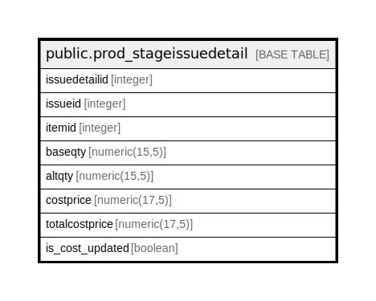

# public.prod_stageissuedetail

## Description

## Columns

| Name | Type | Default | Nullable | Children | Parents | Comment |
| ---- | ---- | ------- | -------- | -------- | ------- | ------- |
| issuedetailid | integer | nextval('prod_stageissuedetail_issuedetailid_seq'::regclass) | false |  |  |  |
| issueid | integer |  | true |  |  |  |
| itemid | integer |  | true |  |  |  |
| baseqty | numeric(15,5) |  | true |  |  |  |
| altqty | numeric(15,5) |  | true |  |  |  |
| costprice | numeric(17,5) | 0 | true |  |  |  |
| totalcostprice | numeric(17,5) | 0 | true |  |  |  |
| is_cost_updated | boolean | true | false |  |  |  |

## Constraints

| Name | Type | Definition |
| ---- | ---- | ---------- |
| prod_stageissuedetail_pkey | PRIMARY KEY | PRIMARY KEY (issuedetailid) |

## Indexes

| Name | Definition |
| ---- | ---------- |
| prod_stageissuedetail_pkey | CREATE UNIQUE INDEX prod_stageissuedetail_pkey ON public.prod_stageissuedetail USING btree (issuedetailid) |

## Relations

---

> Generated by [tbls](https://github.com/k1LoW/tbls)
