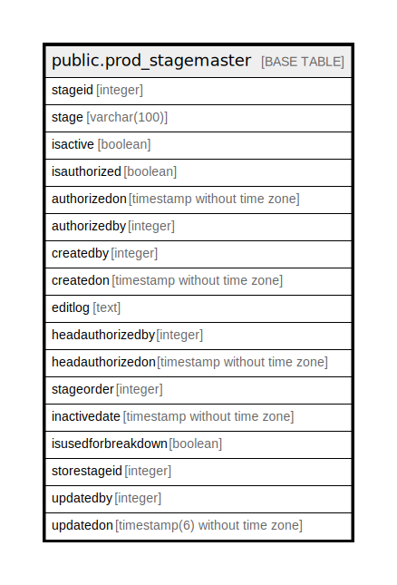

# public.prod_stagemaster

## Description

## Columns

| Name | Type | Default | Nullable | Children | Parents | Comment |
| ---- | ---- | ------- | -------- | -------- | ------- | ------- |
| stageid | integer | nextval('prod_stagemaster_stageid_seq'::regclass) | false |  |  |  |
| stage | varchar(100) |  | false |  |  |  |
| isactive | boolean | true | false |  |  |  |
| isauthorized | boolean | false | false |  |  |  |
| authorizedon | timestamp without time zone |  | true |  |  |  |
| authorizedby | integer |  | true |  |  |  |
| createdby | integer |  | true |  |  |  |
| createdon | timestamp without time zone | now() | true |  |  |  |
| editlog | text |  | true |  |  |  |
| headauthorizedby | integer |  | true |  |  |  |
| headauthorizedon | timestamp without time zone |  | true |  |  |  |
| stageorder | integer |  | true |  |  |  |
| inactivedate | timestamp without time zone |  | true |  |  |  |
| isusedforbreakdown | boolean | false | false |  |  |  |
| storestageid | integer | nextval('storestageid_seq'::regclass) | false |  |  | This is common auto generated id for both table. |
| updatedby | integer |  | true |  |  |  |
| updatedon | timestamp(6) without time zone | NULL::timestamp without time zone | true |  |  |  |

## Constraints

| Name | Type | Definition |
| ---- | ---- | ---------- |
| stagemaster_pkey | PRIMARY KEY | PRIMARY KEY (stageid) |
| stagemaster_stage_key | UNIQUE | UNIQUE (stage) |

## Indexes

| Name | Definition |
| ---- | ---------- |
| stagemaster_pkey | CREATE UNIQUE INDEX stagemaster_pkey ON public.prod_stagemaster USING btree (stageid) |
| stagemaster_stage_key | CREATE UNIQUE INDEX stagemaster_stage_key ON public.prod_stagemaster USING btree (stage) |

## Relations

---

> Generated by [tbls](https://github.com/k1LoW/tbls)
