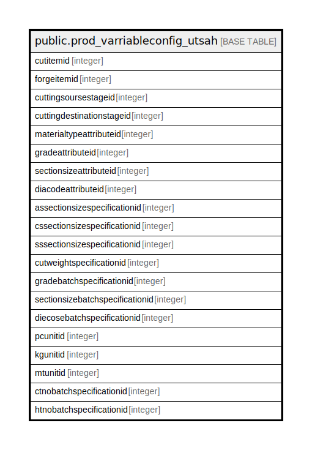

# public.prod_varriableconfig_utsah

## Description

## Columns

| Name | Type | Default | Nullable | Children | Parents | Comment |
| ---- | ---- | ------- | -------- | -------- | ------- | ------- |
| cutitemid | integer |  | true |  |  |  |
| forgeitemid | integer |  | true |  |  |  |
| cuttingsoursestageid | integer |  | true |  |  |  |
| cuttingdestinationstageid | integer |  | true |  |  |  |
| materialtypeattributeid | integer |  | true |  |  |  |
| gradeattributeid | integer |  | true |  |  |  |
| sectionsizeattributeid | integer |  | true |  |  |  |
| diacodeattributeid | integer |  | true |  |  |  |
| assectionsizespecificationid | integer |  | true |  |  |  |
| cssectionsizespecificationid | integer |  | true |  |  |  |
| sssectionsizespecificationid | integer |  | true |  |  |  |
| cutweightspecificationid | integer |  | true |  |  |  |
| gradebatchspecificationid | integer |  | true |  |  |  |
| sectionsizebatchspecificationid | integer |  | true |  |  |  |
| diecosebatchspecificationid | integer |  | true |  |  |  |
| pcunitid | integer | 0 | true |  |  |  |
| kgunitid | integer | 0 | true |  |  |  |
| mtunitid | integer | 0 | true |  |  |  |
| ctnobatchspecificationid | integer |  | true |  |  |  |
| htnobatchspecificationid | integer |  | true |  |  |  |

## Relations

---

> Generated by [tbls](https://github.com/k1LoW/tbls)
