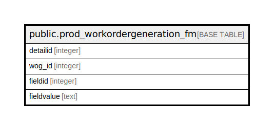

# public.prod_workordergeneration_fm

## Description

## Columns

| Name | Type | Default | Nullable | Children | Parents | Comment |
| ---- | ---- | ------- | -------- | -------- | ------- | ------- |
| detailid | integer | nextval('prod_workordergeneration_fm_detailid_seq'::regclass) | false |  |  |  |
| wog_id | integer |  | true |  |  |  |
| fieldid | integer |  | true |  |  |  |
| fieldvalue | text |  | true |  |  |  |

## Constraints

| Name | Type | Definition |
| ---- | ---- | ---------- |
| prod_workordergeneration_fm_pkey | PRIMARY KEY | PRIMARY KEY (detailid) |

## Indexes

| Name | Definition |
| ---- | ---------- |
| prod_workordergeneration_fm_pkey | CREATE UNIQUE INDEX prod_workordergeneration_fm_pkey ON public.prod_workordergeneration_fm USING btree (detailid) |

## Relations

---

> Generated by [tbls](https://github.com/k1LoW/tbls)
