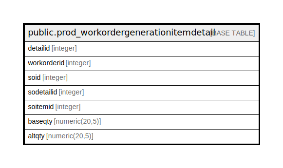

# public.prod_workordergenerationitemdetail

## Description

## Columns

| Name | Type | Default | Nullable | Children | Parents | Comment |
| ---- | ---- | ------- | -------- | -------- | ------- | ------- |
| detailid | integer | nextval('prod_workordergenerationitemdetail_detailid_seq'::regclass) | false |  |  |  |
| workorderid | integer |  | false |  |  |  |
| soid | integer |  | false |  |  |  |
| sodetailid | integer |  | false |  |  |  |
| soitemid | integer |  | false |  |  |  |
| baseqty | numeric(20,5) |  | true |  |  |  |
| altqty | numeric(20,5) |  | true |  |  |  |

## Constraints

| Name | Type | Definition |
| ---- | ---- | ---------- |
| prod_workordergenerationitemdetail_pkey | PRIMARY KEY | PRIMARY KEY (detailid) |

## Indexes

| Name | Definition |
| ---- | ---------- |
| prod_workordergenerationitemdetail_pkey | CREATE UNIQUE INDEX prod_workordergenerationitemdetail_pkey ON public.prod_workordergenerationitemdetail USING btree (detailid) |

## Relations

---

> Generated by [tbls](https://github.com/k1LoW/tbls)
