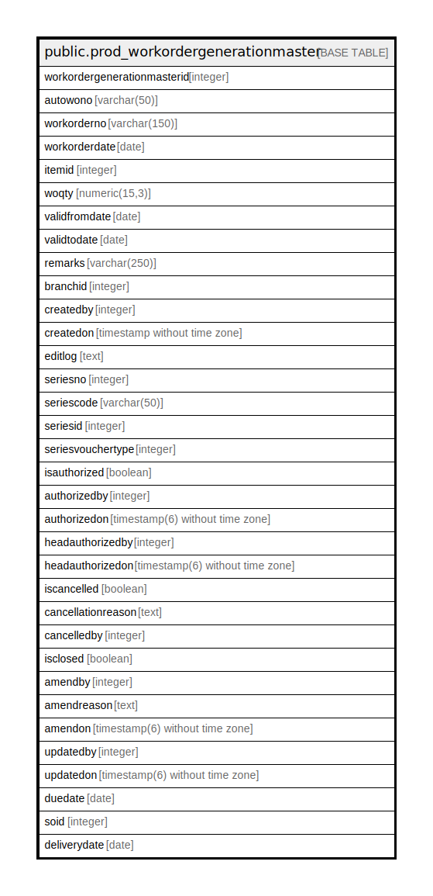

# public.prod_workordergenerationmaster

## Description

## Columns

| Name | Type | Default | Nullable | Children | Parents | Comment |
| ---- | ---- | ------- | -------- | -------- | ------- | ------- |
| workordergenerationmasterid | integer | nextval('prod_workordergenerationmaster_workordergenerationmasterid_seq'::regclass) | false |  |  |  |
| autowono | varchar(50) |  | true |  |  |  |
| workorderno | varchar(150) |  | true |  |  |  |
| workorderdate | date |  | true |  |  |  |
| itemid | integer |  | true |  |  |  |
| woqty | numeric(15,3) |  | true |  |  |  |
| validfromdate | date |  | true |  |  |  |
| validtodate | date |  | true |  |  |  |
| remarks | varchar(250) |  | true |  |  |  |
| branchid | integer |  | true |  |  |  |
| createdby | integer |  | true |  |  |  |
| createdon | timestamp without time zone | now() | true |  |  |  |
| editlog | text |  | true |  |  |  |
| seriesno | integer |  | true |  |  |  |
| seriescode | varchar(50) |  | true |  |  |  |
| seriesid | integer |  | true |  |  |  |
| seriesvouchertype | integer |  | true |  |  |  |
| isauthorized | boolean | false | true |  |  |  |
| authorizedby | integer |  | true |  |  |  |
| authorizedon | timestamp(6) without time zone |  | true |  |  |  |
| headauthorizedby | integer |  | true |  |  |  |
| headauthorizedon | timestamp(6) without time zone |  | true |  |  |  |
| iscancelled | boolean | false | false |  |  |  |
| cancellationreason | text |  | true |  |  |  |
| cancelledby | integer |  | true |  |  |  |
| isclosed | boolean | false | false |  |  |  |
| amendby | integer |  | true |  |  |  |
| amendreason | text | ''::text | true |  |  |  |
| amendon | timestamp(6) without time zone |  | true |  |  |  |
| updatedby | integer |  | true |  |  |  |
| updatedon | timestamp(6) without time zone | NULL::timestamp without time zone | true |  |  |  |
| duedate | date |  | true |  |  |  |
| soid | integer |  | true |  |  |  |
| deliverydate | date |  | true |  |  |  |

## Constraints

| Name | Type | Definition |
| ---- | ---- | ---------- |
| prod_workordergenerationmaster_pkey | PRIMARY KEY | PRIMARY KEY (workordergenerationmasterid) |

## Indexes

| Name | Definition |
| ---- | ---------- |
| prod_workordergenerationmaster_pkey | CREATE UNIQUE INDEX prod_workordergenerationmaster_pkey ON public.prod_workordergenerationmaster USING btree (workordergenerationmasterid) |

## Triggers

| Name | Definition |
| ---- | ---------- |
| wog_amend_log_entry | CREATE TRIGGER wog_amend_log_entry BEFORE UPDATE ON public.prod_workordergenerationmaster FOR EACH ROW EXECUTE FUNCTION wog_amend_log_entry() |

## Relations

---

> Generated by [tbls](https://github.com/k1LoW/tbls)
