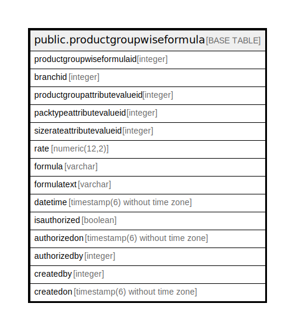

# public.productgroupwiseformula

## Description

## Columns

| Name | Type | Default | Nullable | Children | Parents | Comment |
| ---- | ---- | ------- | -------- | -------- | ------- | ------- |
| productgroupwiseformulaid | integer | nextval('productgroupwiseformula_productgroupwiseformulaid_seq'::regclass) | false |  |  |  |
| branchid | integer |  | true |  |  |  |
| productgroupattributevalueid | integer |  | true |  |  |  |
| packtypeattributevalueid | integer |  | true |  |  |  |
| sizerateattributevalueid | integer |  | true |  |  |  |
| rate | numeric(12,2) | 0 | true |  |  |  |
| formula | varchar |  | true |  |  |  |
| formulatext | varchar |  | true |  |  |  |
| datetime | timestamp(6) without time zone | now() | true |  |  |  |
| isauthorized | boolean | false | false |  |  |  |
| authorizedon | timestamp(6) without time zone |  | true |  |  |  |
| authorizedby | integer |  | true |  |  |  |
| createdby | integer |  | true |  |  |  |
| createdon | timestamp(6) without time zone | now() | true |  |  |  |

## Constraints

| Name | Type | Definition |
| ---- | ---- | ---------- |
| productgroupwiseformula_pkey | PRIMARY KEY | PRIMARY KEY (productgroupwiseformulaid) |

## Indexes

| Name | Definition |
| ---- | ---------- |
| productgroupwiseformula_pkey | CREATE UNIQUE INDEX productgroupwiseformula_pkey ON public.productgroupwiseformula USING btree (productgroupwiseformulaid) |

## Relations

---

> Generated by [tbls](https://github.com/k1LoW/tbls)
