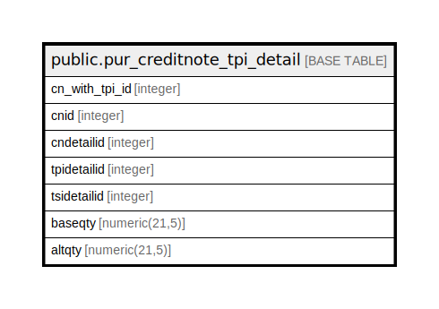

# public.pur_creditnote_tpi_detail

## Description

## Columns

| Name | Type | Default | Nullable | Children | Parents | Comment |
| ---- | ---- | ------- | -------- | -------- | ------- | ------- |
| cn_with_tpi_id | integer | nextval('pur_creditnote_tpi_detail_cn_with_tpi_id_seq'::regclass) | false |  |  |  |
| cnid | integer |  | true |  |  |  |
| cndetailid | integer |  | true |  |  |  |
| tpidetailid | integer |  | true |  |  |  |
| tsidetailid | integer |  | true |  |  |  |
| baseqty | numeric(21,5) | 0 | true |  |  |  |
| altqty | numeric(21,5) | 0 | true |  |  |  |

## Constraints

| Name | Type | Definition |
| ---- | ---- | ---------- |
| pur_creditnote_tpi_detail_pkey | PRIMARY KEY | PRIMARY KEY (cn_with_tpi_id) |

## Indexes

| Name | Definition |
| ---- | ---------- |
| pur_creditnote_tpi_detail_pkey | CREATE UNIQUE INDEX pur_creditnote_tpi_detail_pkey ON public.pur_creditnote_tpi_detail USING btree (cn_with_tpi_id) |

## Relations

---

> Generated by [tbls](https://github.com/k1LoW/tbls)
