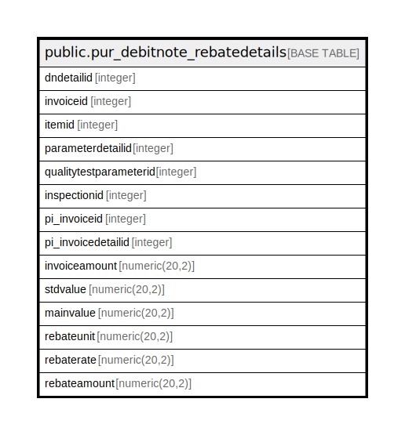

# public.pur_debitnote_rebatedetails

## Description

## Columns

| Name | Type | Default | Nullable | Children | Parents | Comment |
| ---- | ---- | ------- | -------- | -------- | ------- | ------- |
| dndetailid | integer | nextval('pur_debitnote_rebatedetails_dndetailid_seq'::regclass) | false |  |  |  |
| invoiceid | integer |  | true |  |  |  |
| itemid | integer |  | true |  |  |  |
| parameterdetailid | integer |  | true |  |  |  |
| qualitytestparameterid | integer |  | true |  |  |  |
| inspectionid | integer |  | true |  |  |  |
| pi_invoiceid | integer |  | true |  |  |  |
| pi_invoicedetailid | integer |  | true |  |  |  |
| invoiceamount | numeric(20,2) |  | true |  |  |  |
| stdvalue | numeric(20,2) |  | true |  |  |  |
| mainvalue | numeric(20,2) |  | true |  |  |  |
| rebateunit | numeric(20,2) |  | true |  |  |  |
| rebaterate | numeric(20,2) |  | true |  |  |  |
| rebateamount | numeric(20,2) |  | true |  |  |  |

## Constraints

| Name | Type | Definition |
| ---- | ---- | ---------- |
| dn_rebatedetails_pkey | PRIMARY KEY | PRIMARY KEY (dndetailid) |

## Indexes

| Name | Definition |
| ---- | ---------- |
| dn_rebatedetails_pkey | CREATE UNIQUE INDEX dn_rebatedetails_pkey ON public.pur_debitnote_rebatedetails USING btree (dndetailid) |

## Relations

---

> Generated by [tbls](https://github.com/k1LoW/tbls)
