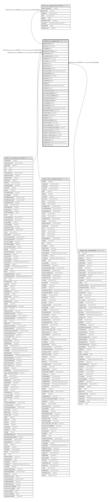

# public.pur_gateentry

## Description

## Columns

| Name | Type | Default | Nullable | Children | Parents | Comment |
| ---- | ---- | ------- | -------- | -------- | ------- | ------- |
| gateentryid | integer | nextval('pur_gateentry_gateentryid_seq'::regclass) | false | [public.pur_gateentrychallan](public.pur_gateentrychallan.md) |  |  |
| entryno | varchar(50) |  | false |  |  |  |
| entrydate | date |  | true |  |  |  |
| gatekeepername | integer |  | true |  | [public.hr_employeemaster](public.hr_employeemaster.md) |  |
| partyname | integer |  | true |  | [public.comn_partymaster](public.comn_partymaster.md) |  |
| nameofperson | varchar(30) |  | true |  |  |  |
| vehicalno | varchar(20) |  | true |  |  |  |
| remarks | varchar(300) |  | true |  |  |  |
| userid | integer |  | false |  | [public.sec_usermaster](public.sec_usermaster.md) |  |
| branchid | integer |  | true |  |  |  |
| isauthorized | boolean | false | false |  |  |  |
| authorizedon | timestamp without time zone |  | true |  |  |  |
| authorizedby | integer |  | true |  |  |  |
| seriescode | varchar(50) |  | true |  |  |  |
| seriesno | integer |  | true |  |  |  |
| createdby | integer |  | true |  |  |  |
| editlog | text |  | true |  |  |  |
| createdon | timestamp without time zone | now() | true |  |  |  |
| seriesid | integer |  | true |  |  |  |
| headauthorizedon | timestamp without time zone |  | true |  |  |  |
| headauthorizedby | integer |  | true |  |  |  |
| pur_comp_employee | integer |  | true |  |  |  |
| seriesvouchertype | integer | 0 | true |  |  |  |
| cancellationreason | text |  | true |  |  |  |
| cancelledby | integer |  | true |  |  |  |
| iscancelled | boolean | false | true |  |  |  |
| incomingtime | timestamp without time zone |  | true |  |  |  |
| transportername | varchar(50) |  | true |  |  |  |
| drivername | varchar(50) |  | true |  |  |  |
| packtype | varchar(50) |  | true |  |  |  |
| packsize | integer |  | true |  |  |  |
| noofcartonreceive | integer |  | true |  |  |  |
| couriername | varchar(100) |  | true |  |  |  |
| courieraddress | varchar(200) |  | true |  |  |  |
| couriercontactpersonname | varchar(100) |  | true |  |  |  |
| courierpersonno | varchar(50) |  | true |  |  |  |
| amazon_invoice_no | varchar(50) | ''::character varying | true |  |  |  |
| amazon_shipment_id | varchar(50) | ''::character varying | true |  |  |  |
| amazon_order_id | varchar(50) |  | true |  |  |  |
| updatedby | integer |  | true |  |  |  |
| updatedon | timestamp(6) without time zone | NULL::timestamp without time zone | true |  |  |  |
| invoice_id | integer |  | true |  |  |  |

## Constraints

| Name | Type | Definition |
| ---- | ---- | ---------- |
| gateentry_fk | FOREIGN KEY | FOREIGN KEY (gatekeepername) REFERENCES hr_employeemaster(employeeid) ON UPDATE CASCADE |
| gateentry_pkey | PRIMARY KEY | PRIMARY KEY (gateentryid) |
| gateentry_fk1 | FOREIGN KEY | FOREIGN KEY (partyname) REFERENCES comn_partymaster(partyid) ON UPDATE CASCADE |
| gateentry_fk2 | FOREIGN KEY | FOREIGN KEY (userid) REFERENCES sec_usermaster(id) ON UPDATE CASCADE |

## Indexes

| Name | Definition |
| ---- | ---------- |
| gateentry_pkey | CREATE UNIQUE INDEX gateentry_pkey ON public.pur_gateentry USING btree (gateentryid) |
| ui_gateent_no | CREATE UNIQUE INDEX ui_gateent_no ON public.pur_gateentry USING btree (branchid, entryno, entrydate, iscancelled, seriesid) WHERE (gateentryid > 0) |

## Relations

---

> Generated by [tbls](https://github.com/k1LoW/tbls)
