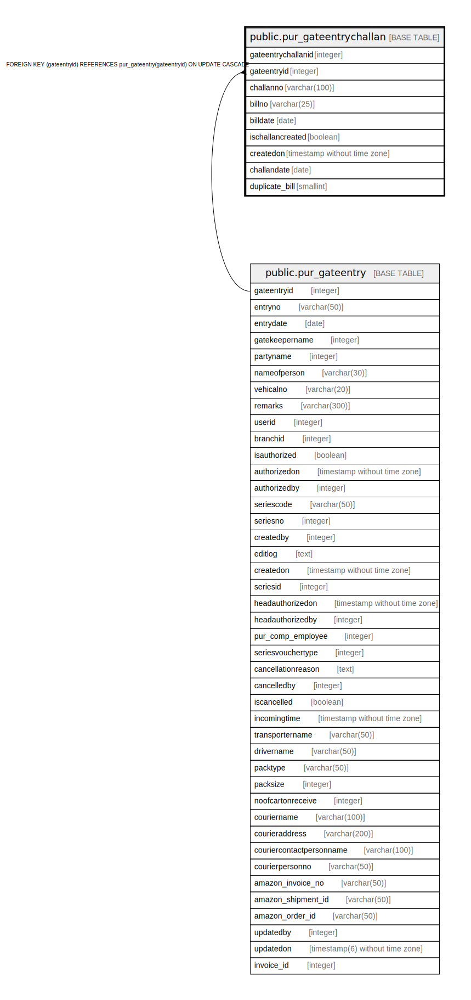

# public.pur_gateentrychallan

## Description

## Columns

| Name | Type | Default | Nullable | Children | Parents | Comment |
| ---- | ---- | ------- | -------- | -------- | ------- | ------- |
| gateentrychallanid | integer | nextval('pur_gateentrychallan_gateentrychallanid_seq'::regclass) | false |  |  |  |
| gateentryid | integer |  | true |  | [public.pur_gateentry](public.pur_gateentry.md) |  |
| challanno | varchar(100) |  | true |  |  |  |
| billno | varchar(25) |  | true |  |  |  |
| billdate | date |  | true |  |  |  |
| ischallancreated | boolean | false | true |  |  |  |
| createdon | timestamp without time zone | now() | true |  |  |  |
| challandate | date |  | true |  |  |  |
| duplicate_bill | smallint | 0 | false |  |  |  |

## Constraints

| Name | Type | Definition |
| ---- | ---- | ---------- |
| gateentrychallan_fk | FOREIGN KEY | FOREIGN KEY (gateentryid) REFERENCES pur_gateentry(gateentryid) ON UPDATE CASCADE |
| gateentrychallan_pkey | PRIMARY KEY | PRIMARY KEY (gateentrychallanid) |

## Indexes

| Name | Definition |
| ---- | ---------- |
| gateentrychallan_pkey | CREATE UNIQUE INDEX gateentrychallan_pkey ON public.pur_gateentrychallan USING btree (gateentrychallanid) |
| Index_GE_Det_GEID | CREATE INDEX "Index_GE_Det_GEID" ON public.pur_gateentrychallan USING btree (gateentryid) |

## Relations

---

> Generated by [tbls](https://github.com/k1LoW/tbls)
