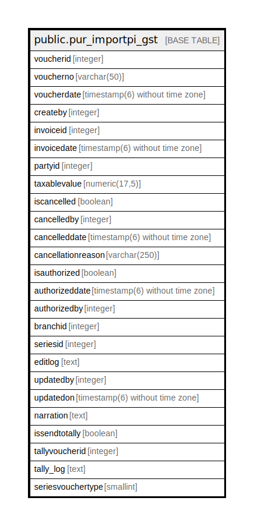

# public.pur_importpi_gst

## Description

## Columns

| Name | Type | Default | Nullable | Children | Parents | Comment |
| ---- | ---- | ------- | -------- | -------- | ------- | ------- |
| voucherid | integer | nextval('pur_importpi_gst_voucherid_seq'::regclass) | false |  |  |  |
| voucherno | varchar(50) |  | true |  |  |  |
| voucherdate | timestamp(6) without time zone | now() | true |  |  |  |
| createby | integer |  | true |  |  |  |
| invoiceid | integer |  | true |  |  |  |
| invoicedate | timestamp(6) without time zone |  | true |  |  |  |
| partyid | integer |  | true |  |  |  |
| taxablevalue | numeric(17,5) | 0 | true |  |  |  |
| iscancelled | boolean | false | true |  |  |  |
| cancelledby | integer |  | true |  |  |  |
| cancelleddate | timestamp(6) without time zone |  | true |  |  |  |
| cancellationreason | varchar(250) |  | true |  |  |  |
| isauthorized | boolean | true | false |  |  |  |
| authorizeddate | timestamp(6) without time zone |  | true |  |  |  |
| authorizedby | integer |  | true |  |  |  |
| branchid | integer |  | true |  |  |  |
| seriesid | integer |  | true |  |  |  |
| editlog | text |  | true |  |  |  |
| updatedby | integer |  | true |  |  |  |
| updatedon | timestamp(6) without time zone | NULL::timestamp without time zone | true |  |  |  |
| narration | text | ''::text | true |  |  |  |
| issendtotally | boolean | false | true |  |  |  |
| tallyvoucherid | integer | 0 | true |  |  |  |
| tally_log | text | ''::text | true |  |  |  |
| seriesvouchertype | smallint | 0 | true |  |  |  |

## Constraints

| Name | Type | Definition |
| ---- | ---- | ---------- |
| pur_importpi_gst_pkey | PRIMARY KEY | PRIMARY KEY (voucherid) |

## Indexes

| Name | Definition |
| ---- | ---------- |
| pur_importpi_gst_pkey | CREATE UNIQUE INDEX pur_importpi_gst_pkey ON public.pur_importpi_gst USING btree (voucherid) |

## Relations

---

> Generated by [tbls](https://github.com/k1LoW/tbls)
