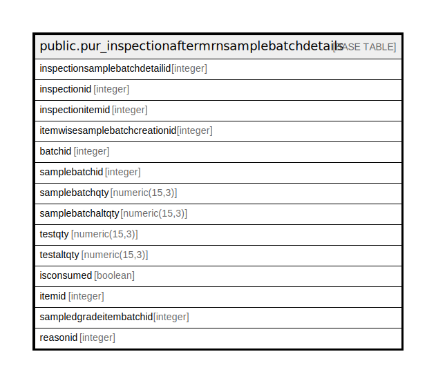

# public.pur_inspectionaftermrnsamplebatchdetails

## Description

## Columns

| Name | Type | Default | Nullable | Children | Parents | Comment |
| ---- | ---- | ------- | -------- | -------- | ------- | ------- |
| inspectionsamplebatchdetailid | integer | nextval('pur_inspectionaftermrnsampleb_inspectionsamplebatchdetailid_seq'::regclass) | false |  |  |  |
| inspectionid | integer |  | true |  |  |  |
| inspectionitemid | integer |  | true |  |  |  |
| itemwisesamplebatchcreationid | integer |  | true |  |  |  |
| batchid | integer |  | true |  |  |  |
| samplebatchid | integer |  | true |  |  |  |
| samplebatchqty | numeric(15,3) |  | true |  |  |  |
| samplebatchaltqty | numeric(15,3) |  | true |  |  |  |
| testqty | numeric(15,3) |  | true |  |  |  |
| testaltqty | numeric(15,3) |  | true |  |  |  |
| isconsumed | boolean | false | false |  |  |  |
| itemid | integer |  | true |  |  |  |
| sampledgradeitembatchid | integer |  | true |  |  |  |
| reasonid | integer |  | true |  |  |  |

## Constraints

| Name | Type | Definition |
| ---- | ---- | ---------- |
| pur_inspectionaftermrnsamplebatchdetails_pkey | PRIMARY KEY | PRIMARY KEY (inspectionsamplebatchdetailid) |

## Indexes

| Name | Definition |
| ---- | ---------- |
| pur_inspectionaftermrnsamplebatchdetails_pkey | CREATE UNIQUE INDEX pur_inspectionaftermrnsamplebatchdetails_pkey ON public.pur_inspectionaftermrnsamplebatchdetails USING btree (inspectionsamplebatchdetailid) |

## Relations

---

> Generated by [tbls](https://github.com/k1LoW/tbls)
