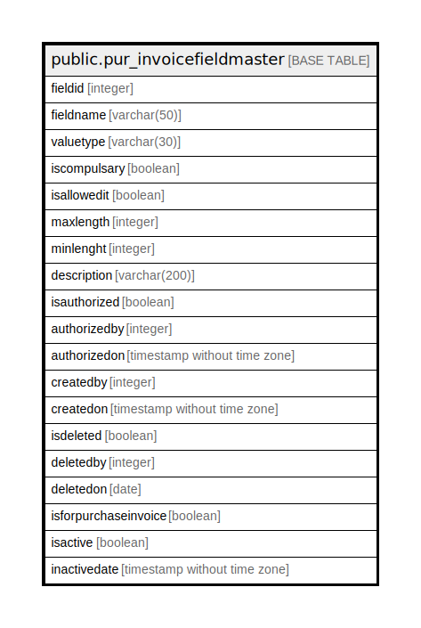

# public.pur_invoicefieldmaster

## Description

## Columns

| Name | Type | Default | Nullable | Children | Parents | Comment |
| ---- | ---- | ------- | -------- | -------- | ------- | ------- |
| fieldid | integer | nextval('pur_invoicefieldmaster_fieldid_seq'::regclass) | false |  |  |  |
| fieldname | varchar(50) | NULL::character varying | true |  |  |  |
| valuetype | varchar(30) | NULL::character varying | true |  |  |  |
| iscompulsary | boolean |  | true |  |  |  |
| isallowedit | boolean |  | true |  |  |  |
| maxlength | integer |  | true |  |  |  |
| minlenght | integer |  | true |  |  |  |
| description | varchar(200) | NULL::character varying | true |  |  |  |
| isauthorized | boolean |  | true |  |  |  |
| authorizedby | integer |  | true |  |  |  |
| authorizedon | timestamp without time zone |  | true |  |  |  |
| createdby | integer |  | true |  |  |  |
| createdon | timestamp without time zone | now() | true |  |  |  |
| isdeleted | boolean |  | true |  |  |  |
| deletedby | integer |  | true |  |  |  |
| deletedon | date |  | true |  |  |  |
| isforpurchaseinvoice | boolean | true | true |  |  |  |
| isactive | boolean |  | true |  |  |  |
| inactivedate | timestamp without time zone |  | true |  |  |  |

## Constraints

| Name | Type | Definition |
| ---- | ---- | ---------- |
| pur_invoicefieldmaster_pkey | PRIMARY KEY | PRIMARY KEY (fieldid) |

## Indexes

| Name | Definition |
| ---- | ---------- |
| pur_invoicefieldmaster_pkey | CREATE UNIQUE INDEX pur_invoicefieldmaster_pkey ON public.pur_invoicefieldmaster USING btree (fieldid) |

## Relations

---

> Generated by [tbls](https://github.com/k1LoW/tbls)
