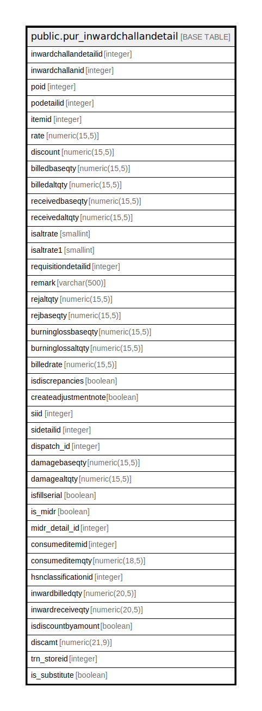

# public.pur_inwardchallandetail

## Description

## Columns

| Name | Type | Default | Nullable | Children | Parents | Comment |
| ---- | ---- | ------- | -------- | -------- | ------- | ------- |
| inwardchallandetailid | integer | nextval('pur_inwardchallandetail_inwardchallandetailid_seq'::regclass) | false |  |  |  |
| inwardchallanid | integer |  | true |  |  |  |
| poid | integer |  | true |  |  |  |
| podetailid | integer |  | true |  |  |  |
| itemid | integer |  | true |  |  |  |
| rate | numeric(15,5) |  | true |  |  |  |
| discount | numeric(15,5) |  | true |  |  |  |
| billedbaseqty | numeric(15,5) |  | true |  |  |  |
| billedaltqty | numeric(15,5) |  | true |  |  |  |
| receivedbaseqty | numeric(15,5) |  | true |  |  |  |
| receivedaltqty | numeric(15,5) |  | true |  |  |  |
| isaltrate | smallint |  | true |  |  |  |
| isaltrate1 | smallint |  | true |  |  |  |
| requisitiondetailid | integer |  | true |  |  |  |
| remark | varchar(500) | NULL::character varying | true |  |  |  |
| rejaltqty | numeric(15,5) |  | true |  |  |  |
| rejbaseqty | numeric(15,5) |  | true |  |  |  |
| burninglossbaseqty | numeric(15,5) |  | true |  |  |  |
| burninglossaltqty | numeric(15,5) |  | true |  |  |  |
| billedrate | numeric(15,5) |  | true |  |  |  |
| isdiscrepancies | boolean | false | true |  |  |  |
| createadjustmentnote | boolean | false | true |  |  | credit or debit note |
| siid | integer |  | true |  |  |  |
| sidetailid | integer |  | true |  |  |  |
| dispatch_id | integer |  | true |  |  |  |
| damagebaseqty | numeric(15,5) |  | true |  |  |  |
| damagealtqty | numeric(15,5) |  | true |  |  |  |
| isfillserial | boolean | false | true |  |  |  |
| is_midr | boolean |  | true |  |  |  |
| midr_detail_id | integer |  | true |  |  |  |
| consumeditemid | integer |  | true |  |  |  |
| consumeditemqty | numeric(18,5) |  | true |  |  |  |
| hsnclassificationid | integer |  | true |  |  |  |
| inwardbilledqty | numeric(20,5) |  | true |  |  |  |
| inwardreceiveqty | numeric(20,5) |  | true |  |  |  |
| isdiscountbyamount | boolean | false | true |  |  |  |
| discamt | numeric(21,9) | 0 | true |  |  |  |
| trn_storeid | integer |  | true |  |  |  |
| is_substitute | boolean | false | true |  |  |  |

## Constraints

| Name | Type | Definition |
| ---- | ---- | ---------- |
| pur_inwardchallandetail_pkey | PRIMARY KEY | PRIMARY KEY (inwardchallandetailid) |

## Indexes

| Name | Definition |
| ---- | ---------- |
| pur_inwardchallandetail_pkey | CREATE UNIQUE INDEX pur_inwardchallandetail_pkey ON public.pur_inwardchallandetail USING btree (inwardchallandetailid) |
| Index_IC_Det_ICID | CREATE INDEX "Index_IC_Det_ICID" ON public.pur_inwardchallandetail USING btree (inwardchallanid) |
| Index_InwardDet_ID | CREATE INDEX "Index_InwardDet_ID" ON public.pur_inwardchallandetail USING btree (inwardchallanid) |

## Relations

---

> Generated by [tbls](https://github.com/k1LoW/tbls)
