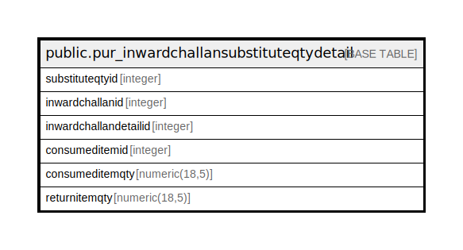

# public.pur_inwardchallansubstituteqtydetail

## Description

## Columns

| Name | Type | Default | Nullable | Children | Parents | Comment |
| ---- | ---- | ------- | -------- | -------- | ------- | ------- |
| substituteqtyid | integer | nextval('pur_inwardchallansubstituteqtydetail_substituteqtyid_seq'::regclass) | false |  |  |  |
| inwardchallanid | integer |  | true |  |  |  |
| inwardchallandetailid | integer |  | true |  |  |  |
| consumeditemid | integer |  | true |  |  |  |
| consumeditemqty | numeric(18,5) |  | true |  |  |  |
| returnitemqty | numeric(18,5) |  | true |  |  |  |

## Constraints

| Name | Type | Definition |
| ---- | ---- | ---------- |
| pur_inwardchallansubstituteqtydetail_pkey | PRIMARY KEY | PRIMARY KEY (substituteqtyid) |

## Indexes

| Name | Definition |
| ---- | ---------- |
| pur_inwardchallansubstituteqtydetail_pkey | CREATE UNIQUE INDEX pur_inwardchallansubstituteqtydetail_pkey ON public.pur_inwardchallansubstituteqtydetail USING btree (substituteqtyid) |

## Relations

---

> Generated by [tbls](https://github.com/k1LoW/tbls)
