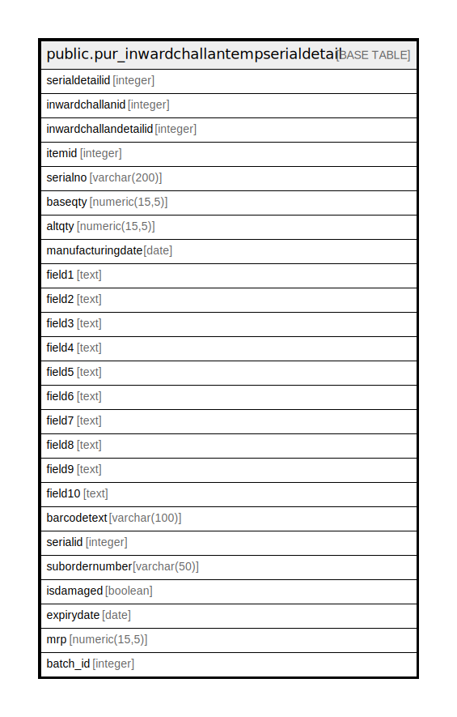

# public.pur_inwardchallantempserialdetail

## Description

## Columns

| Name | Type | Default | Nullable | Children | Parents | Comment |
| ---- | ---- | ------- | -------- | -------- | ------- | ------- |
| serialdetailid | integer | nextval('pur_inwardchallantempserialdetail_serialdetailid_seq'::regclass) | false |  |  |  |
| inwardchallanid | integer |  | true |  |  |  |
| inwardchallandetailid | integer |  | true |  |  |  |
| itemid | integer |  | true |  |  |  |
| serialno | varchar(200) |  | true |  |  |  |
| baseqty | numeric(15,5) |  | true |  |  |  |
| altqty | numeric(15,5) |  | true |  |  |  |
| manufacturingdate | date |  | true |  |  |  |
| field1 | text |  | true |  |  | gross weight |
| field2 | text |  | true |  |  | line no |
| field3 | text |  | true |  |  |  |
| field4 | text |  | true |  |  |  |
| field5 | text |  | true |  |  |  |
| field6 | text |  | true |  |  |  |
| field7 | text |  | true |  |  |  |
| field8 | text |  | true |  |  |  |
| field9 | text |  | true |  |  |  |
| field10 | text |  | true |  |  |  |
| barcodetext | varchar(100) |  | true |  |  |  |
| serialid | integer | 0 | false |  |  |  |
| subordernumber | varchar(50) | ''::character varying | true |  |  |  |
| isdamaged | boolean | false | true |  |  |  |
| expirydate | date |  | true |  |  |  |
| mrp | numeric(15,5) | NULL::numeric | true |  |  |  |
| batch_id | integer |  | true |  |  |  |

## Constraints

| Name | Type | Definition |
| ---- | ---- | ---------- |
| pur_inwardchallantempserialdetail_pkey | PRIMARY KEY | PRIMARY KEY (serialdetailid) |

## Indexes

| Name | Definition |
| ---- | ---------- |
| pur_inwardchallantempserialdetail_pkey | CREATE UNIQUE INDEX pur_inwardchallantempserialdetail_pkey ON public.pur_inwardchallantempserialdetail USING btree (serialdetailid) |
| Index_Inward_Sr1 | CREATE INDEX "Index_Inward_Sr1" ON public.pur_inwardchallantempserialdetail USING btree (inwardchallanid, inwardchallandetailid, field2, serialno, itemid, substr((serialno)::text, 1, 3)) |
| Index_Inward_Sr2 | CREATE INDEX "Index_Inward_Sr2" ON public.pur_inwardchallantempserialdetail USING btree (inwardchallanid) |

## Relations

---

> Generated by [tbls](https://github.com/k1LoW/tbls)
