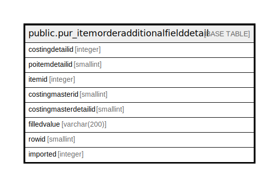

# public.pur_itemorderadditionalfielddetail

## Description

## Columns

| Name | Type | Default | Nullable | Children | Parents | Comment |
| ---- | ---- | ------- | -------- | -------- | ------- | ------- |
| costingdetailid | integer | nextval('pur_itemorderadditionalfielddetail_costingdetailid_seq'::regclass) | false |  |  |  |
| poitemdetailid | smallint |  | false |  |  |  |
| itemid | integer |  | false |  |  |  |
| costingmasterid | smallint |  | false |  |  |  |
| costingmasterdetailid | smallint |  | true |  |  |  |
| filledvalue | varchar(200) |  | true |  |  |  |
| rowid | smallint |  | true |  |  |  |
| imported | integer | 0 | true |  |  |  |

## Constraints

| Name | Type | Definition |
| ---- | ---- | ---------- |
| pur_itemorderadditionalfielddetail_pkey | PRIMARY KEY | PRIMARY KEY (costingdetailid) |

## Indexes

| Name | Definition |
| ---- | ---------- |
| pur_itemorderadditionalfielddetail_pkey | CREATE UNIQUE INDEX pur_itemorderadditionalfielddetail_pkey ON public.pur_itemorderadditionalfielddetail USING btree (costingdetailid) |

## Relations

---

> Generated by [tbls](https://github.com/k1LoW/tbls)
