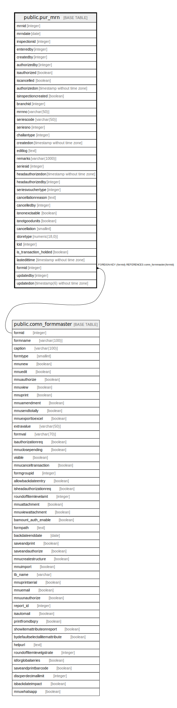

# public.pur_mrn

## Description

## Columns

| Name | Type | Default | Nullable | Children | Parents | Comment |
| ---- | ---- | ------- | -------- | -------- | ------- | ------- |
| mrnid | integer | nextval('pur_mrn_mrnid_seq'::regclass) | false |  |  |  |
| mrndate | date |  | true |  |  |  |
| inspectionid | integer |  | true |  |  |  |
| enteredby | integer |  | true |  |  |  |
| createdby | integer |  | true |  |  |  |
| authorizedby | integer |  | true |  |  |  |
| isauthorized | boolean |  | true |  |  |  |
| iscancelled | boolean |  | true |  |  |  |
| authorizedon | timestamp without time zone |  | true |  |  |  |
| isinspectioncreated | boolean |  | true |  |  |  |
| branchid | integer |  | true |  |  |  |
| mrnno | varchar(50) |  | true |  |  |  |
| seriescode | varchar(50) |  | true |  |  |  |
| seriesno | integer |  | true |  |  |  |
| challantype | integer |  | true |  |  |  |
| createdon | timestamp without time zone | now() | true |  |  |  |
| editlog | text |  | true |  |  |  |
| remarks | varchar(1000) |  | true |  |  |  |
| seriesid | integer |  | true |  |  |  |
| headauthorizedon | timestamp without time zone |  | true |  |  |  |
| headauthorizedby | integer |  | true |  |  |  |
| seriesvouchertype | integer | 0 | true |  |  |  |
| cancellationreason | text |  | true |  |  |  |
| cancelledby | integer |  | true |  |  |  |
| isnonexcisable | boolean | false | true |  |  |  |
| isnotgoodunits | boolean | false | true |  |  | use excisable check box in front end for challantype=8 |
| cancellation | smallint | 0 | true |  |  |  |
| storetype | numeric(18,0) |  | true |  |  |  |
| lcid | integer |  | true |  |  |  |
| is_transaction_holded | boolean | false | true |  |  |  |
| lastedittime | timestamp without time zone | now() | false |  |  | If concurrent user accessing same record for the update, based on this time we can validate the last access time. |
| formid | integer | 34 | false |  | [public.comn_formmaster](public.comn_formmaster.md) |  |
| updatedby | integer |  | true |  |  |  |
| updatedon | timestamp(6) without time zone | NULL::timestamp without time zone | true |  |  |  |

## Constraints

| Name | Type | Definition |
| ---- | ---- | ---------- |
| pur_mrn_formid_fkey | FOREIGN KEY | FOREIGN KEY (formid) REFERENCES comn_formmaster(formid) |
| pur_mrn_inspectionid_key | UNIQUE | UNIQUE (inspectionid, iscancelled, cancellation) |
| pur_mrn_pkey | PRIMARY KEY | PRIMARY KEY (mrnid) |

## Indexes

| Name | Definition |
| ---- | ---------- |
| pur_mrn_inspectionid_key | CREATE UNIQUE INDEX pur_mrn_inspectionid_key ON public.pur_mrn USING btree (inspectionid, iscancelled, cancellation) |
| pur_mrn_pkey | CREATE UNIQUE INDEX pur_mrn_pkey ON public.pur_mrn USING btree (mrnid) |
| Index_MRN_IBMID | CREATE INDEX "Index_MRN_IBMID" ON public.pur_mrn USING btree (inspectionid) |
| ui_mrn_no | CREATE UNIQUE INDEX ui_mrn_no ON public.pur_mrn USING btree (branchid, seriesvouchertype, mrndate, mrnno) WHERE (mrnid > 0) |

## Triggers

| Name | Definition |
| ---- | ---------- |
| tgr_updatecostdate_mrn | CREATE TRIGGER tgr_updatecostdate_mrn AFTER INSERT OR UPDATE ON public.pur_mrn FOR EACH ROW EXECUTE FUNCTION tgr_updatecostdate() |

## Relations

---

> Generated by [tbls](https://github.com/k1LoW/tbls)
