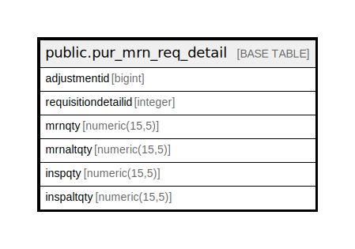

# public.pur_mrn_req_detail

## Description

## Columns

| Name | Type | Default | Nullable | Children | Parents | Comment |
| ---- | ---- | ------- | -------- | -------- | ------- | ------- |
| adjustmentid | bigint | nextval('pur_mrn_req_detail_adjustmentid_seq'::regclass) | false |  |  |  |
| requisitiondetailid | integer |  | false |  |  |  |
| mrnqty | numeric(15,5) |  | false |  |  |  |
| mrnaltqty | numeric(15,5) |  | true |  |  |  |
| inspqty | numeric(15,5) |  | true |  |  |  |
| inspaltqty | numeric(15,5) |  | true |  |  |  |

## Constraints

| Name | Type | Definition |
| ---- | ---- | ---------- |
| pur_mrn_req_detail_pkey | PRIMARY KEY | PRIMARY KEY (adjustmentid) |

## Indexes

| Name | Definition |
| ---- | ---------- |
| pur_mrn_req_detail_pkey | CREATE UNIQUE INDEX pur_mrn_req_detail_pkey ON public.pur_mrn_req_detail USING btree (adjustmentid) |

## Relations

---

> Generated by [tbls](https://github.com/k1LoW/tbls)
