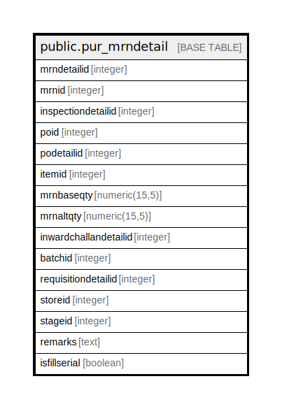

# public.pur_mrndetail

## Description

## Columns

| Name | Type | Default | Nullable | Children | Parents | Comment |
| ---- | ---- | ------- | -------- | -------- | ------- | ------- |
| mrndetailid | integer | nextval('pur_mrndetail_mrndetailid_seq'::regclass) | false |  |  |  |
| mrnid | integer |  | true |  |  |  |
| inspectiondetailid | integer |  | true |  |  |  |
| poid | integer |  | true |  |  |  |
| podetailid | integer |  | true |  |  |  |
| itemid | integer |  | true |  |  |  |
| mrnbaseqty | numeric(15,5) |  | true |  |  |  |
| mrnaltqty | numeric(15,5) |  | true |  |  |  |
| inwardchallandetailid | integer |  | true |  |  |  |
| batchid | integer |  | true |  |  |  |
| requisitiondetailid | integer |  | true |  |  |  |
| storeid | integer |  | true |  |  |  |
| stageid | integer |  | true |  |  |  |
| remarks | text |  | true |  |  |  |
| isfillserial | boolean | false | true |  |  |  |

## Constraints

| Name | Type | Definition |
| ---- | ---- | ---------- |
| pur_mrndetail_pkey | PRIMARY KEY | PRIMARY KEY (mrndetailid) |

## Indexes

| Name | Definition |
| ---- | ---------- |
| pur_mrndetail_pkey | CREATE UNIQUE INDEX pur_mrndetail_pkey ON public.pur_mrndetail USING btree (mrndetailid) |
| Index_MRNDet_MRNID | CREATE INDEX "Index_MRNDet_MRNID" ON public.pur_mrndetail USING btree (mrnid) |
| Index_MRN_Det_MRNID | CREATE INDEX "Index_MRN_Det_MRNID" ON public.pur_mrndetail USING btree (mrnid) |

## Relations

---

> Generated by [tbls](https://github.com/k1LoW/tbls)
