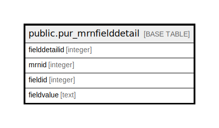

# public.pur_mrnfielddetail

## Description

## Columns

| Name | Type | Default | Nullable | Children | Parents | Comment |
| ---- | ---- | ------- | -------- | -------- | ------- | ------- |
| fielddetailid | integer | nextval('pur_mrn_fielddetailid_seq'::regclass) | false |  |  |  |
| mrnid | integer |  | false |  |  |  |
| fieldid | integer |  | false |  |  |  |
| fieldvalue | text |  | true |  |  |  |

## Constraints

| Name | Type | Definition |
| ---- | ---- | ---------- |
| pur_mrnfielddetail_mrnid_fieldid_key | UNIQUE | UNIQUE (mrnid, fieldid) |
| pur_mrnfielddetail_pkey | PRIMARY KEY | PRIMARY KEY (fielddetailid) |

## Indexes

| Name | Definition |
| ---- | ---------- |
| pur_mrnfielddetail_mrnid_fieldid_key | CREATE UNIQUE INDEX pur_mrnfielddetail_mrnid_fieldid_key ON public.pur_mrnfielddetail USING btree (mrnid, fieldid) |
| pur_mrnfielddetail_pkey | CREATE UNIQUE INDEX pur_mrnfielddetail_pkey ON public.pur_mrnfielddetail USING btree (fielddetailid) |

## Relations

---

> Generated by [tbls](https://github.com/k1LoW/tbls)
